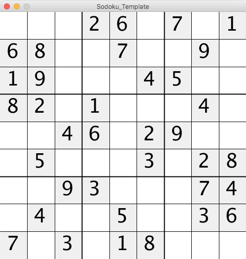
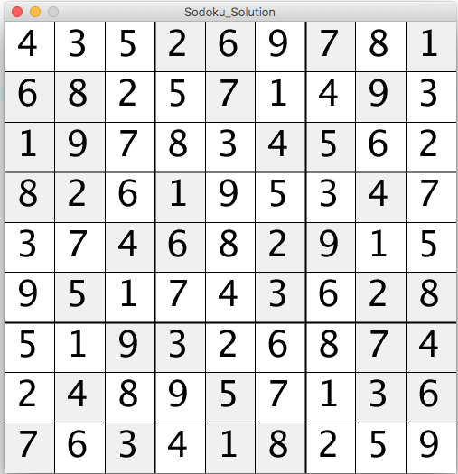
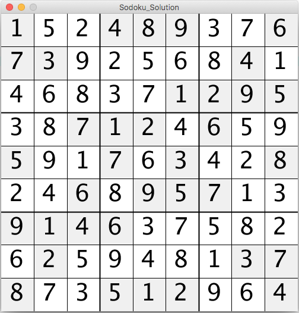

# Sodoku Solver

Creator: Nathaniel Shak

In this project, we will code a program to *solve a Sodoku puzzle*. Pretty cool right?

## Recommended prior knowledge required to attempt this project

Now, as a warning, this is a pretty advanced project, so here's a couple of things you should have a firm grasp of before trying this.

Before attempting this project, students should:

* Be very familiar with Java.
* Understand classes and objects well.
* Be familiar with Java datastructures, such as lists and 2d arrays.
* Understand the concepts of recursion and depth-first-search.
* Have experience psuedocoding and solving complex algorithmic coding problems.

## Goals of this project

By completing this project, students will:

* Gain a greater practical understanding of recursion and depth-first-search.
* Understand in greater depth the uses and practicality of recursion and depth-first-search.
* Get experience designing and implementing solutions to complex algorithmic problems.
* Get experience working with complex datastructures and classes in Java.

## Getting Started

First, download the Sodoku\_Template folder and open Sodoku\_Template in Processing. For this project, we give you a decent amount of code to start. When you run the program for the first time, you should see something like this:

This is what our Sodoku board looks like without us having solved it. You'll notice that some squares are shaded in gray. These squares are the ones that we have no control over, while all the squares in white are the ones that we must fill out in our solution.

Now, let's take a look at the code.

There's a lot there. Thankfully, the only two functions you'll need to modify are in lines 86-96:

	//solves the sodoku puzzle and sets board to be the solution
	public void solveBoard(){
	    //TODO: Complete this!
	}
	  
  	//returns a list of all the valid numbers that could be put in the spot represented by cord on the board passed in as the curBoard variable
	//this will be very helpful in your solver function on the recursive step
	public List<Integer> validMoves(Coordinate cord, int[][] curBoard){
		//TODO: Complete this (to use in your solver function)
	    return null;
	}

solveBoard is the function that the program will call that we will need to implement to solve the sodoku board (and then store the solution in the `board` variable). validMoves is a function that, while it is not required, it is highly reccomended that you implement in order to help you with the solveBoard function.

Now let's take a look at some of the rest of the code.

On line 33, you'll see the coordinate class:

	//represents the position of a given square on the board -> has an x and a y coordinate
	class Coordinate {
	  
	  public int x;
	  public int y;
	  
	  Coordinate(int x, int y){
	    this.x = x;
	    this.y = y;
	  }
	}
	
This class was created to make it easier to represent positions on the Sodoku board. Simply access the x and the y variables like this:

	cord.x
	cord.y
	
(assuming that cord variable was defined earlier as an instance of Coordinate)

In the Sodoku class, you'll see the following variables:

	class Sodoku {
	 
	int[][] board; //holds all the numbers on the board 0's are used to store unfilled spaces
	List<Coordinate> blankSquares = new ArrayList<Coordinate>(); //all the spaces the player has control over
	
	...

`board` is a 9x9 2D array that stores all the numbers of the Sodoku board. 0's are used to represent unfilled spaces. Your solveBoard function should modify or set this variable to be the solved Sodoku board (in 9x9 2d array form).

`blankSquares` is a list of Coordinate objects as defined above that hold all the positions of the spaces that the player must fill out (the white spaces). This will be useful to keep track of what spaces must be filled out by your solver function.

The rest of the code is mostly around setting up the board and displaying numbers. You'll notice if you look at the draw loop:

	void draw(){
	  if(solve && !solved) {
	    board.solveBoard();
	    board.printBoard();
	    solved = true;
	  }
	}
	
	void mouseClicked() {
	  solve = true;
	}
	
That the solveBoard function won't be called and displayed until you click. Just to make sure you don't solve the solution then wonder why nothing's showing up ;)

Anyways, good luck!

## Tips

### Psuedocode it out!

This is a complicated problem that has a solution that is not the most straightforward. Once you're familiar with the code, take a step back and write out on paper the steps that you think your solution should take before starting to type out the code.

### Be careful of passing by reference

One you're implementing your recursive solution, you will probably have to pass around some data in the form of 2D arrays and/or lists. Remember that in Java **objects are passed by reference**, meaning that if I pass a variable that stores something like a 2D array or a list into a function as a parameter, it will be the same 2D array or list being used in the place I passed it from. This can get especially hairy when you're using recursion.

Just to illustrate this, if I had the following code:

	int a[][] = new int[8][];
	modifyArray(a);
	printArray(a);

Whatever was done in modifyArray to `a` to a would still be in place when printArray(a) was called.

If you do not want this to happen, you will need to **make a copy** of the array before passing it into the function. We've provided the twoDArrCopy function on line 47 to make this easier for you.

In addition, if you're thinking of doing the same thing for lists, there may be an easier way that involved keeping track of a number instead of the whole list :).

### Checking correctness

Also, if you're not sure if you got the right answer or not, here's what it should look like for each of the boards if you got the right solution:

#### Board 1:

#### Board 2:

Anyways, that's it from me. Let's get to it!