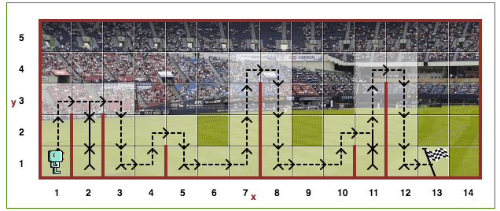
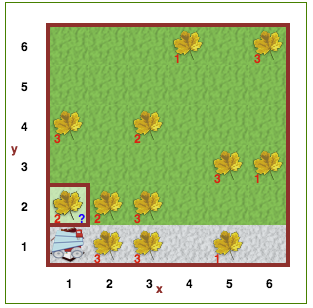

# Reeborg Sequence

## Introduction
This sequence serves as an outline for guiding students in Intro To Hack through Reeborg activities. To reach the Reeborg website, go to: **[http://reeborg.ca/reeborg.html](http://reeborg.ca/reeborg.html)**.

Students will be working with Reeborg on either the **Python** setting or the **Blockly(Py)** setting, depending on their current level. The Python setting uses type in commands/functions and is ideal for older students/those who have shown aptitude to move onto higher level syntax based activities later in the teaching term. The Blockly(Py) setting uses a block based language and is ideal for younger students/those who will continue in block based activities for the teaching term. As you get to know the students you are working with, you will most likely get a good sense of which track would be better for them. 

You can change this setting in the drop down menu located on the top right side of the toolbar. It should look something like this:


This sequence is written for the Python setting; however, much of it also applies for the Blockly setting, with small syntax related differences.

## Sequence Overview
Below, you'll find a table of contents of the generalized lesson sequence. Feel free to alter it to better target an individual student's personal interests or needs.

1. Introduction to Commands
2. For Loops/Repeats
3. Basic Conditions/If Statements
4. While Loops
5. Combining Conditions/Advanced Conditions
6. Challenges

## Navigating Reeborg
You can help your student navigate to the pre-loaded world with the same name as the exercises (in the **Exercise Breakdown** part of this document) in Reeborg using the top toolbar. Here is a screenshot for your reference:


Once you have loaded the world, click on **World Info** on the top toolbar to pop open the instructions for the exercise. Read this through with your student and use the breakdown to guide your discussion.

> If no worlds show up when under the toolbar, you may need to click "Other Worlds", then click on one of the collections. Most of these exercises are under "Introduction Reeborg".

 - The section called **What you need to know** in the World Info pop up may be a bit of a spoiler, as it explicitly lays out certain concepts that we want to encourage students to discover for themselves. If you need more structured instruction, this section is helpful, but it might be nice to avoid reading it until after you've tried to get your student to think about the ideas with guiding questions.

 

Your student will type their code in the section called **Python Code** on the right side of the screen. If you or your student ever need a refresher on all the commands and conditional statements available in Reeborg's world, the **Reeborg's keyboard** button in the top toolbar is a helpful resource to refer to.

You'll also see **play, pause, stop and rewind buttons** at the top of the world. These are used to run the code the student has written. If they aren't sure about how to proceed on an exercise, encourage them to write code and try out different possibilities. *Explain to them that a huge part of computer science is the iterative process, where testing partially functioning code and learning from mistakes is highly encouraged.*

# Exercises
## 1. Introduction to Commands
Introduce the idea of a command/function to the student. 
Consider using analogies like: "Think about how a cook uses a recipe from a cookbook to make food. These recipes give you instructions on how you complete a task, namely, baking a cake or boiling pasta. Similarly, the commands in a function give instructions that direct the computer in completing a task. You tell it what to do". Or be creative and finding an interesting way to convey the information!

Here are some formal definitions if they are helpful for guiding instruction.
**Command:** A  _command_  is an instruction given by a user telling a  computer to do something, such a run a single program or a group of linked programs.
**Program:** A _program_ is a sequence of instructions that is understandable by a CPU (central processing unit), the main logic unit of a computer. (http://www.linfo.org/program.html)  

### Exercise: Home 1


**Guiding Questions:**

We know that in Home 1, we want to write a program with commands to help Reeborg reach home. What type of instruction would be helpful to do that? What type of action do we want Reeborg to take?

Let's learn about the `move()` command. This command moves Reeborg one unit in the grid world, in the direction that Reeborg is facing.

With this information, encourage the student to try coding up a program for Home 1 using `move()` .  

If they need some help putting together more than one command, remind them that the program will execute the code from top to bottom in order, completing each command after the last has finished. Also, remind them that each command gets its own line.

### Exercise: Home 3


**Guiding Questions:**

How do we get Reeborg to move in a different direction/face a different way?

This exercise introduces the `turn_left()` command.  This command allows Reeborg to change direction so that they can move in a different direction.

Have your student try Home 3, using `move()` from Home 1 and `turn_left()` from this exercise.

### Exercise: Newspaper


**Guiding Questions:**

We have a `turn_left()` command, but no turn right command. There are times where programming languages don't have a direct command for something you want to do. In this case we can define a new function. How would we defined a `turn_right()` function using `turn_left()`? 

In this case, that would look something like this:

```python
def turn_right():
    turn_left()
    turn_left()
    turn_left()
```
 - Keep in mind that the functions that are defined must be defined before the main body of the program, like C++, otherwise they will not be recognized

This exercise also introduce the commands `take()` and `put()`. Reeborg can pick up objects with `take()` and put down objects it is carrying with `put()`. Reeborg can only pick up objects when it is standing on the cell the object is in. Reeborg can only put down an object if it is already carrying the object.

Have your student try to complete the newspaper delivery exercise. You'll notice that the code for it is a little redundant, so you may want to introduce some decomposition with functions if the student shows a good understanding of `turn_right()`. 

### *Optional Exercise: Tokens 4


> Skip and go on to **2. For Loops/Repeats** if student shows solid understanding of this material

For more practice with `take()` and `put()`, have your student try Token 4. The more advanced section of the instructions encourages a generalized solution for all the token worlds. For now, you can ignore this unless a student shows interest. We'll come back to this stuff.

## 2. For Loops/Repeats

### Exercise: Around 1


**Guiding Questions:**

You may have noticed in Newspaper or Token 4 that some of the same code was written over and over again. How do we reduce redundancy?

We can avoid redundancy by using a control statement called a **for loop**. This will allow you to repeat a certain command or set of commands multiple times without actually typing it out over and over again (making it easier for others to read your code and condensing the length of your code).

There are two ways to do this in Reeborg's world. Have your student use whichever works better.

 - Do let your student know that `repeat` does not actually exist in Python language

Option 1 (in Python language, a bit harder to grasp)

```python
for i in range(5):
	#commands to repeat
```

Option 2 (only in Reeborg language, easier to grasp)

```python
repeat 5:
	#commands to repeat
```

Have the student try to complete the Around 1 exercise. If they are having trouble, encourage them to try writing out the program command by command and then have them point out to you which parts are the same. Use that warm-up as a starting point for helping them figure out what information goes in the `#number of repeats` and `#commands to repeat` fields.

> For students moving quickly, you could optionally ask them to see if they could figure out how to use nested repeats/for loops so that they don't have to write the same for loop multiple times.

### Exercise: Hurdle 1


**Guiding Questions:**

How could you use repeat to jump the hurdles?
What commands would you put inside the for loop (what actions need to be repeated)?

This exercise expands on the concept of a for loop. Have your student use concepts learned from Around 1 to tackle this problem.

It may be helpful to ask your student: "What does Reeborg have to do to get from (1, 1) to (3, 1) in the Hurdle 1 world? How is that similar to the actions that Reeborg has to take to get from (3, 1) to (5, 1)?" if they are having trouble determining which unit of work needs to be repeated. 

This block of actions should looks something like:

```python
move()
turn_left()
move()
turn_right()
move()
turn_right()
move()
turn_left()
```

 - Note that it's important that Reeborg is re-positioned in the correct direction after reaching the final position, so that the same exact block of actions can be repeated
	 - This might be a good exercise for discussing the value of attention to detail
- Remind them to save this code, as it may come in handy for future exercises.

> As a review of functions you could encourage them to try decomposing their code to use a `jump_hurdle` function instead of putting all the code in the repeat statement. Give them a chance to write the code without the function first though.

## 3. Basic Conditions/If Statements

### Exercise: Around 1 - apple


**Guiding Questions:**

How could we use an if statement to pick up an apple if there is one where Reeborg is standing, but not when there isn't one?

Knowing that the apples randomize each time, would we be able to write a solution that works on all worlds with what we know so far?

Have them reflect on the idea that any solution of just raw commands wouldn't work if even one apple changed positions in the world, so it's couldn't be used to solve a slightly different problem of Reeborg collecting apples in a world where the apples are arranged in another order.

#### Introducing the "if" statement

Have students think about certain actions that only occur if something is true. Explain that conditional statements check whether something is true/false and execute the commands nested inside if the condition is true. For example: "When your parents are driving, they accelerate the car *if the traffic light is green*. If they accelerated the car forward when the traffic light was red, they might run into another car".

Have the student look around under the Reeborg's keyboard section in the toolbar. Ask them to point out which condition might be useful in this case. For your reference, they're looking for the `object_here()` condition.

This condition would be used in the following way:

```python
if object_here():
	#commands to execute
```

Now, have them use the for loop code (similar to Around 1) along with if statements to make Reeborg go around and collect all of the apples.

## 4. While Loops

### Exercise: Around 1 - variable


Explain that in this exercise, the size of the world changes.

**Guiding Questions:**

Would a for loop work here? Why or why not?
If we don't know how large the world is, what type of condition would we need to check for to know when to stop Reeborg?
How can we use the tokens that Reeborg has to keep track of where Reeborg started? How can we use the presence of this token at the start to get Reeborg to get back to the start position?

All these questions are meant to get the student started in thinking about the logic of the while loop.

#### Introducing the "while" loop

The while loop is a relative of the for loop and the if statement. Essentially, it says to repeat while some condition is true.

The while loop would be used in the following way:

```python
while some_condition:
	#commands to execute
```

> Here it could be helpful to examine some real life applications of this. For example **while** I'm hungry, I'll keep eating. **while** I'm not at my destination, I'm going to keep driving. Feel free to draw out the code of what it would look like if you were a computer and this were your code for the student.

The conditions to check for that might be useful include:

 - `front_is_clear()`
 - `wall_in_front()`
 - `object_here()`
 
 It might also be helpful to introduce `not`, which can go in front of a condition to negate what the condition checks for.

### Exercise: Hurdle 2


In this exercise, the location of the flag changes.

**Guiding Questions:**

How is this problem similar and different from Hurdle 1?
How could you modify your Hurdle 1 code to solve this problem?

If you did not introduce `not` previously, this would be a good place to do so. Once again, have the student open up Reeborg's keyboard and look for which condition is the most helpful. For your reference, they're looking for `at_goal()`.

Have the student test this code on Hurdle 1 too. Ask them why they think the Hurdle 2 code also solves the problem in Hurdle 1, but the converse is not true.

### Extension exercises:

Here are some possible exercises that you can encourage your student to work on if they want more practice with while loops. The next section, **5. Combining Conditions/Advanced Conditions**, contains many more complicated exercises that required nested conditions. If your student is having trouble with those exercises, these are good ones to try.

### Exercise: Tokens 1-5 (returning to these problems and solving them in a different way)


**Guiding Questions:**
How can you use while loops to solve the Tokens problem for all five Tokens worlds?
How are the five worlds similar to one another?

See if you can guide your students to the following insights. All of the worlds share certain common patterns:

-   one or more tokens in a row, with no gap in between;
-   the pile of tokens must be made next to the last token.

 

Have your student recall their original approach to this problem from the Token 4 exercise in **2. For Loops/Repeats**.

Encourage your student to try and devise a different approach to the exercise using while loops. Discuss with them why this kind of solution is able to solve all of the Tokens exercises, as opposed to the original solution, which can only solve the specific Tokens 4 exercise.

## 5. Combining Conditions/Advanced Conditions

### Exercise: Hurdle 3


In this exercise, the position and number of hurdles changes.

**Guiding Questions:**

How can you combine/nest while loops and if statements together to solve this problem?
What types of things do you need to check for?
How can we decompose the code into smaller functions to make it more organized?

 - This is a good place to introduce if/else statements if you feel like your student is at a good place for it.
 - Emphasize decomposition more heavily in Hurdle 3 and Hurdle 4. ie: if they haven't made a "jump_hurdle" function, try to lead them to this.

Have your student test this code from Hurdle 3 on Hurdle 1 and Hurdle 2. Ask them why they think it works for such a diverse set of problems.

### Exercise: Hurdle 4



In this exercise, the position, height and number of hurdles changes.

**Guiding Questions:**

How can you alter Hurdle 3 to solve this problem?

If the code from Hurdle 3 is well-decomposed, this problem should be a small extension on Hurdle 3. Once again, encourage your student to think about while/if together and to work on decomposition.

If your student is struggling, have them jump back to **3. Basic Conditions/If Statements** and **4. While Loops** and review. It may be helpful to have them try **Around 2, 3 and 4** exercises.

Have your student test this code from Hurdle 4 on Hurdle 1, Hurdle 2 and Hurdle 3. Ask them why they think it works for such a diverse set of problems.

Congratulate your student for finishing the StreetCode Reeborg sequence! The following section goes over some challenge problems if your student shows interest or motivation. You can also have them try any other problems they're interested in.

## 6. Challenges

### Exercise: Storm 1


**Guiding Questions:**

How can while loops help us solve the problem?
How many conditions does Reeborg need to check for? What conditions are these?

For this exercise, encourage your student to think about how nested while loops may be helpful for solving the problem. 

This exercise might also be a good place to use a pencil/paper to draw out and visualize the solution the functioning components of the code.

 - Notice that this exercise uses the `toss()` command with the `take()` command, instead of `put()`, which was used in previous exercises
 - `carries_object()` may be another helpful condition to introduce
	 - Remind your student that it can be used along with many of the other conditions from previous exercises to solve the problem
	 - For a refresher on these conditions, look back at the **Around 1- variable** exercise

### Exercise: Storm 2



**Guiding Questions:**

How is this problem similar or different from Storm 1?
This exercise gets into problem solving methods that might be more applicable to real world tasks. Can you think of any type of situation that might require this type of code/algorithm to solve?
Why might we be concerned about solving this problem in the fastest, most efficient way possible?

This exercise is similar to **Harvest 1** in many ways. You can have your student start with **Harvest 1** and build off of it to create the solution for **Storm 2** if that is helpful for them. Otherwise, it may be useful to simply compare the two worlds and discuss what generalized solution would apply to both.

This is also an excellent place to discuss efficiency in code. Though the **Storm 2** solution should work on the **Storm 1** world as well, it is less efficient.  You might discuss the trade-offs of general versus efficient code and talk about other real world problems where this kind of cost benefit analysis applies.

Like in **Storm 1**, it may be helpful to use a pencil/paper to draw out ideas for navigating the worlds. You may point out that some are faster than others (never going to the same cell twice), even if they all solve the problem.

### Exercise: Center 1


This problem is very tricky! But it is very satisfying. Let your student know that this problem is difficult and encourage them to keep going even if they run into obstacles.

 - For any Stanford mentors, this problem is similar to the Midpoint Karel problem from CS106A

**Guiding Questions:**

How can we use the tokens to keep track of different aspects of the situation: how large the world is, where Reeborg has been?
If we don't know how large the world is, how do we go about finding the center point? (spend some time and try to brainstorm an algorithm on paper with your student before coding up a solution)

This problem can be solved using only a few tokens or using many tokens. You can guide the student through whichever method comes to them first. If they choose to use many tokens, you can encourage them to think about how to solve the problem if they were only able to use two tokens once they have completed their initial solution.

### Exercise: Maze


This problem is actually not that difficult to code up a solution to, but very challenging to devise a strategy to solve. In this problem, we will get a lot of practice with psuedocoding and coming up with solutions to complex problems.

**Guiding Questions:** Questions
If you were stuck in a maze, what strategy would you use to try to escape?
Let's try tracing our way through Reeborg's maze. What happens if you always try to go left when you can? What happens if you always try to go right when you can?

Try to guide your student to think about the right-hand rule typically implemented in maze solvers. This is a good place to introduce pseudo-coding to your student if they are not already familiar with this technique. Explain how pseudo-code can be useful for working through more complex algorithm dependent solutions

The maze solution has the following pseudo-code:

```
 1.  Have Reeborg follow along the right edge of the maze
	 2. Turn right if Reeborg can
	 3. Go straight ahead if Reeborg can't turn right
	 4. Turn left as a last resort
```

With the pseudo-code written up, it's much easier to see that the natural structure of this solution requires if/elif/else statements. This might be a good time to explain how conditions are ordered in if/elif/else statements. 

Explain to students students that if/elif/else statements execute top to bottom and as soon as the program determines a true condition, it will execute the commands in that block without checking any of the next conditions.

It could be helpful to ask a question like: "Imagine that Reeborg is at an intersection in the world where both the right is clear (Reeborg can turn right) and the front is clear (Reeborg can go straight), and the first if statement in the code checks for if the front is clear and the second elif statement checks for if the right is clear. What does this code tell Reeborg to do? Is that the correct behavior according to the pseudo-code? What's wrong with this code?". 

Which of these gives you the correct behavior?

```python
if front_is_clear():
	#go straight 
elif right_is_clear():
	#go right
...
```

```python
if right_is_clear():
	#go straight 
elif front_is_clear():
	#go right
...
```

