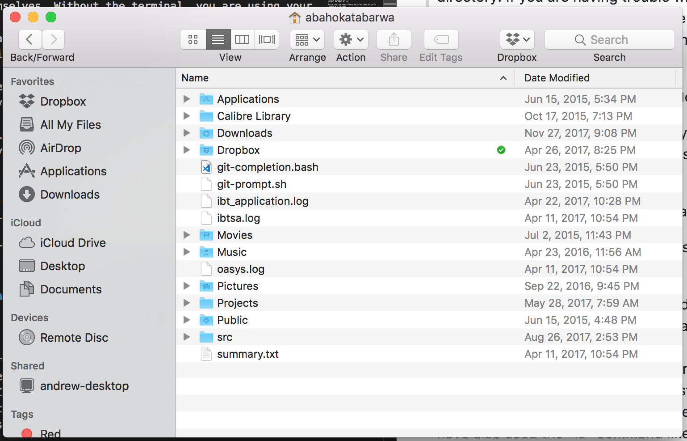
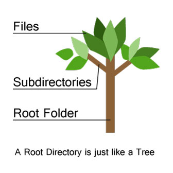

# Lesson 1.1 The Terminal
## Introduction to the Terminal

Today, we’ll be exploring one of the hidden gems of computing. If you have ever watched a movie featuring a hacker doing their “hacking”, you may recall a black screen on their computer that spewed thousands of characters as they frantically typed. My aspiring hacker, I’m here to tell you that that black screen is real, and it’s on your computer. In this lesson I’m going to show you how to use it. It’s not as hard as they made it out to be in the movies. In the following hour or two, you’ll be navigating and executing commands in the terminal! Now, you may not be hacking into the Pentagon’s mainframe tomorrow, but you’ll be one step closer to mastering the full capability of modern computing. 

## Opening the Terminal

[insert tutorial for opening the Terminal for Windows]

[insert tutorial for opening the Terminal for MacOS]

[insert tutorial for opening the Terminal for Linux]

## Demystifying the Terminal
The purpose of training wheels is to keep novice riders from hurting themselves. Without the terminal, you are using your computer in *“training wheel”* mode. The terminal is a powerful place. Anything you can imagine can probably be done in the terminal. In fact, every computer can be used exclusively through the terminal. There’s no need for the desktop home screen, the start menu, or the file explorer (Finder if you are on a Mac). 
Today we’ll be focusing on those commands that can be done in the terminal that render the File Explorer useless. Feel free to impress your friends with your newfound knowledge after this lesson. That being said, please do not run any commands that aren’t taught in this lesson in the terminal. Furthermore, as you become a more experienced user of the terminal, please don’t run commands that you aren’t 100% sure about. Like I said, the terminal is a very powerful place, you could irreversibly damage your computer or … even let a hacker into your computer. 

## Navigating the Terminal

#### cd, ls, and pwd

Open up your File Explorer (again, on Mac computers, this is called Finder). Use your File Explorer to navigate the Home directory. If you are having trouble with this, ask for help. The internet, a friend, or your teacher are all good options. You should see something close to the image below when you are done. 



Take note of the folders and files in your home directory.

Now in the terminal execute the commands shown below one after another.

```
cd ~
ls .
```

Notice that the same folders and files shown by the `ls` command are the same 

Congratulations! You’ve already used two terminal commands. `cd` is the navigation command. It means *“go to”*, and `~` is a symbol meaning the home directory. So `cd ~` means *“go to the home directory”*. That's the exact same thing that we did in the File Explorer! `ls` means *“look in”* and `.` means *"the folder we are currently in"*. So `ls .` means *"look in the folder we are currently in"*. You've done it! Way to navigate to the home directory and take a look inside it!
 
 We could have also accomplished the same exact thing by executing the command below.  

```
ls ~
```

The above usage of the `ls` command means *“look in the home directory”*. 

Now I’d like you to use the `cd` and `ls` command to navigate your file system from the home directory. For example, if you have a `Downloads` directory, run `cd Downloads`, and then `ls .` to see what’s inside your `Downloads` directory. If you want to go backwards (back up to the home directory), you can execute `cd ..`. `..` means *“go backwards one directory"*. So if you were in your `Downloads` directory which is in your home directory, running `cd ..` would move you back to the home directory. It’s that easy.

Take this moment to navigate your file system. If you ever get confused and want to see which directory you are in, run the `pwd` command. This command just lets you know which directory you are currently. That way you never get lost. Isn’t that neat! 


<span style="color:red">**```Instructors at this point should make sure that students are using the above commands to navigate their file systems. At the end of the exercise,students should easily understand how to use `cd`, `ls`, and `pwd`.```**</span>


#### Food For Thought

Take a moment to think about what we’ve just done. What we’ve learned is how to navigate the directory hierarchy or directory tree. Why do they call it a tree? Well, because it looks like one. 



A tree has a root. In our case it’s the home directory where we started and then it has branches and leaves. The branches can be other directories and the leaves are at the ends which are the many files stored on your computer. It’s just like a family tree. Just like you have parents, grandparents, and maybe even children. Directories can have parent directories, grand parent directories, and even child directories.

## Action in the Terminal
#### touch, open, cat, mkdir, mv, rm

The terminal is not just for navigation. The terminal can do so much more. Navigating is just moving around. The real power of the terminal is that the terminal can actually **DO** things. Now we are going to start **DOING** things in the terminal. 

##### the `touch` command
In your home directory, by now you should know how to get there, run the command `touch hello-world.txt`. Now run `ls ~`. Notice that, now your home directory contains a file called `hello-world.txt`. That’s what the `touch` command does! The touch command allows us to create files! It’s as simple as that. 

##### the `open` command
While still in your home directory, run the command `open hello-world.txt`. Notice that a text editor has appeared out of thin air, and it’s opened `hello-world.txt` for you. You can use `open` to open any file in your file system! Now, write whatever you want in `hello-world.txt` using the text editor. Make sure you save your changes and close the text editor. 

##### the `cat` command
Still in your home directory, run the command `cat hello-world.txt`. Notice that what you’d written in your file is now printed in the terminal. `cat` is the command that we use to see the contents of any file. 

##### the `mkdir` command
The next command that we are going to learn is the `mkdir` command. This is the command that allows us to *make directories*. If you really look at it, the command is the abbreviation of *“make directory”*. Isn’t that neat! Remember that a **“directory” is the same thing as a “folder”**. The mkdir command is actually the same as making a new folder! Go ahead and make a folder by executing `mkdir my_directory`. Now execute `ls .`. Notice that “my_directory” is a new folder in your home directory. If you are curious (and you should be), open your File Explorer and you’ll notice that “my_directory” is a new folder on your computer. 

##### the `mv` command
The next command that we are going to learn is the `mv` command. It’s the “move” command. And guess what the move command does. It moves files and folders! Right now, we are going to move a file into a directory. Remember the `hello-world.txt` file that we created a while back. We are going to move that file into the `my_directory` directory. We can use the `mv` command to do this by executing `mv hello-world.txt my_directory`. Let’s `cd` into `my_directory` and then run `ls .` inside it. Review the sections on the `cd` and `ls` commands if you need to. If you succeeded, you should see `hello-world.txt` in that directory. Isn’t that great! Now you don’t have to drag and drop like everybody else! Boss it up and tell them that you know the mv command in the terminal. 

##### the `rm` command 
The last command we will learn is the most dangerous of them all!!! Please be very careful when you use the remove command. It will remove any file or folder that you execute it on. There’s no trash can to save you here. When you remove a file, IT’S GONE. That being said, since we’ve create a some files of our own, we can remove those instead as we practice the remove command. Run `rm hello-world.txt`. Now look inside `my_directory` (You know which command does that.). Notice that the file is gone. Please use the `rm` command with care. Finally, we need to know how to delete directories. First, navigate to your home directory. Now execute `rm -rf my_directory`. Execute `ls .` and notice that `my_directory` is completely gone. 

## Definitions
terminal - the portal that allows us to control our computer at it’s deepest level

file - a word document, a movie, a game, a picture, … anything that can stored as a single unit on our computer system

directory - a folder, a collection of files

directory hierarchy - directories can be side-by-side. they can also be inside each other. this kind of collection of directories is known as a directory hierarchy. 

home directory - the home base directory of your computer, you can navigate to it by executing `cd ~`

command - something you tell the terminal to do for you (`cd`, `ls`, `rm`, and `mv` are examples of commands)

cd - the command that allows us to navigate the directory hierarchy 

pwd - the command that lets us know what directory we are in

ls - the command that lets us know what’s inside a directory

cat - the command that shows us what’s in a file

touch - the command that creates an empty file

open - the command that opens a file. it can also open a directory. 

mv - the command that allows us to move files and directories in our system

rm - the command that allows us to remove files and directories from our system

## Activities: 
1. In your home directory, create two directories. One will be called “hello” and the other will be called “world”. 
Move into the “hello” directory it and view it’s contents with the ls command. It should be empty. 
In your “hello” directory, please create a file named [insert your name].txt. Write anything you want in it. Make a copy of it called [insert your name]-1.txt and then delete the original file. Use the cat command to view the contents of [insert your name]-1.txt.
Move [insert your name]-1.txt from the “hello” directory to the “world” directory. 
In your “world” directory create another directory called “hey-there”. Create a file with the name of your choosing and within that file write your best friend’s name.
Move to your home directory. From your home directory delete all the contents of your “hey-there” directory. 
Finally, from your home directory, delete both the “hello” and “world” directories. 

2. Bonus: Create a complicated directory hierachy and ask a partner to draw it out starting at the root.
3. Create a file and use the `ls` command to tell me when it was created and also when it was last modified. 
4. Move any deeply-nested directory to the home directory directory.  
 
## Goals
Upon completion of this lesson, students should be able to navigate the system directory hierarchy, create files and folders, move files and folders, and finally delete files and folders. Most importantly, students should be comfortable executing commands in the terminal.
 