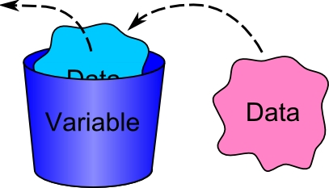
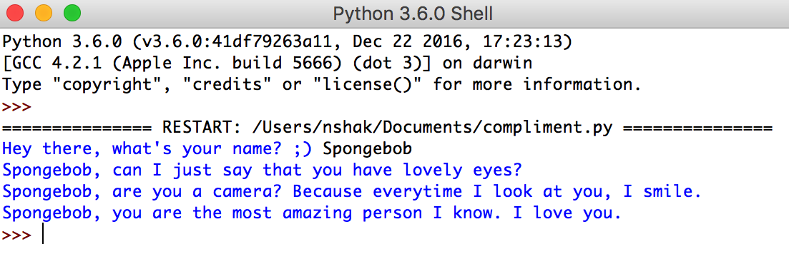
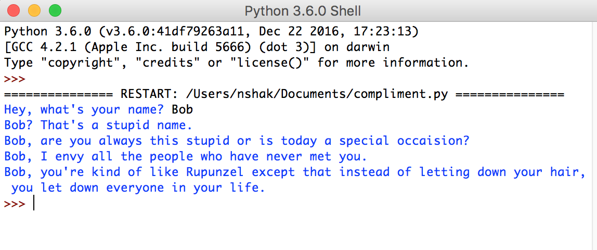

# Introduction to Python
<p> Hello! And welcome to Streetcode!! It's great to have you here! If you're reading this, you're in the Intro to Hack B class, ready to learn Python! We're going to start by showing you what Python is, and why we learn it! </p>

# What is Python?
<p> Have you ever wondered how people build apps, or create websites? Everything on your computer is powered by lines of instructions that tell the computer exactly what to do. We call these lines of instructions "code", and "coding" is nothing but the process of writing those instructions out one-by-one. Python is one of the "languages" used to give the computer instructions - and it's definitely one of the better ones! Here's what Python "code" looks like:

```python 
def draw(self):
        self.canvas.move(self.id, self.xspeed, 0)
        pos = self.canvas.coords(self.id)
        if pos[0] <= 0:
            self.xspeed = 0
        if pos[2] >= 500:
            self.xspeed = 0
```

If this looks a bit intimidating right now - don't worry! We're going to learn exactly how each of those lines work over the next 11 weeks. But if you really look at the code, you'll find it sort of looks a lot like English! The first line <code>def draw(self)</code> looks like its defining something (that's what the word "def" does!). The next line of code looks like it moves something, right? (<code>self.canvas.move</code>). The reason we learn Python is that it really does look a lot like English, and learning it is one of the best ways to learn how to program a computer!

# First lesson - using IDLE!
One of the hardest parts of programming is getting your computer to run your code! This might sound kind of silly - didn't we just say that all a computer does is run code? Well yeah, but getting it to run <italic>your</italic> code is actually kinda tricky. To run your Python code, we're going to use something called "IDLE". When you search your computer for IDLE and run it, you should see something like this:

![IDLE Screenshot][IDLE]

[IDLE]: IDLE.png

IDLE is a program that "runs" your Python code. To get it to run a series of Python instructions (an instruction is just a line of code) that you wrote, click "File" and then "New File". This should open up a window like this: 

![What a New File Looks like][newfile]

[newfile]: newfile.png 

Now, we can get started writing code! For now, type the following line of code into this new window: <code> print ("Hello, World!")</code>, so that the window looks like this:

![Sample Code][samplecode]

[samplecode]: written-code.png

Now, save this file onto your computer. Feel free to ask your teacher for help! I called my file "FirstPython.py". Then, click "Run" and then "Run Module". A new window should pop up that looks like this: 

![Sample Code][runpage]

[runpage]: runpage.png

If it doesn't, ask one of the teachers for help. If it does, congrats :). You just wrote your first line of Python! Your on your way to creating whatever you want on a computer!

To review, you write your code in a  **file**. You can save and edit the code in the file, similar to the way you can update and change a word document. If you use `print()` in your code, this tells the computer to output the things you've specified should be printed when you **run** your program. You'll look for any output printed in the other window that opens on starting IDLE; the **console**.

# Variables
We'll begin by discussing introductory syntax. Syntax describes the rules dictating how code should be written (in order to be understood by the computer), similar to the definition of syntax in the English language.  

The first piece of syntax we're going to talk about is how to define **variables**.  

**Variable:** A variable is a way to store information - the different things you want to remember in your code. You can think of it like a storage unit or a box that holds something.  



For example, if you wanted your code to "remember" your first and last name, you would write something like this: 

```python 
FirstName = "Diwakar"
LastName = "Ganesan"
```

We say we're **assigning a value to a variable** in the above example. Note the structure of the example. The equal sign in Python means something a little different than what you're used to in math. By saying `FirstName = "Diwakar"`, I'm assigning  "Diwakar" to the variable FirstName. You'll follow a similar structure to assign future variables in your own code.

### To create a **variable** in Python, use the following pattern:
**`variable_name = value`**  
**Remember that the equal sign assigns variables in Python.**  

### Some More Rules About Variables

1. You can't have spaces in a variable name. So, you _can't_ do this: 

```python 
First Name = "Diwakar"
```

But, you _can_ do this: 

```python 
First_Name = "Diwakar"
```

Notice the "_" character? It's called an underscore, and it can be used to replace spaces whenever you want spaces in your variable name. 

2. Variable names _can't_ start with a number. So, this wouldn't fly: `2Cool4School = "Me"`.

3. The names of variables describe what kind of information it holds. Though this is not a strict requirement like the first two rules, it's a good practice for writing clear and readable code! 

For example:

```python
#This is an intuitive way to name a variable
dog_breed = "Beagle"

#This is an unintuitive way to name a variable
cat_breed = "Beagle"
```

Though the variable holds the information, `"Beagle"`, it makes more sense to call the variable `dog_breed`, as opposed to `cat_breed`, since `"Beagle"` is a breed of dog. However, since the variable name simply refers to the name of the box holding the information (recall the picture from above), in either case, you've created a variable holding `"Beagle"`.

# Values: What kinds of information can we assign to variables?

Now, what can we store in variables? There are really only two different kinds of variables we can store in Python: **numbers** and **text**.  

## Numbers
The most important thing you'd want your program to remember are numbers. To remember numbers in Python, you can use code like this: 

```python 
my_age = 18
favorite_number = 32
```

You can also write expressions with variables that involve numbers and assign values to new variables using previously defined variables!  

For example, if I write:

```python
my_favorite_number = 15
another_number = my_favorite_number * 2 - 10
```
Then, `another_number` will equal 20 (the value in `my_favorite_number` times 2 minus 10, which is 20). Again, we're assigning `another_number` to equal `my_favorite_number * 2 - 10`.

After writing all the code above in a file in IDLE, to test this all out, you could try:

```python
print(another_number)
```

and see if it prints out what you expected.

### Exercise 1

Go ahead and work with your mentor to make several variables that store the above answers as variables. You may also need to create some new variables and assign them values using previously defined variables (like in the another_number example above). You can Google anything you need to answer the weather related questions.  

1. What's the expected high temperature today?
2. What's the expected low temperature today?
3. What's the average temperature today?  
**Hint:** How do you calculate average? Try using the variables defined in parts 1 and 2.
4. What's the percent humidity, expressed as a percentage?
5. What's the percent humidity, expressed as a decimal?  
**Hint:** Try using the variable defined in part 4 and recall that to convert a percetage to a decimal, we divide by 100.
6. What's the temperature at this moment, in Fahrenheit?
7. Here's a trickier one! What's the temperature at this moment, in Celsius?  
**Hint:** T(°C) = (T(°F) - 32) × 5/9

Print out the **value** stored in each **variable** (using `print(variable_name)` learned above) to make sure it matches your expectation.  

> **Note to mentors:** It can be helpful to grab a piece of paper to visualize the idea of a variable. Draw out boxes for each variable labeled with the variable name and write the value currently stored in it. If variables are re-assigned to new values, cross out the old value and update it with the new value.

## Text
Python also let's you remember short pieces of text, like your name! But, it's a bit tricky. You _can't_ do this: 

```python
name = Diwakar Ganesan
```

Even though you followed the usual convention (`variable_name = value`), text needs to be surrounded by **quotations**. Text that's surrounded by quotations is called a **string**. So, the following line of code would work:

```python
name = "Diwakar Ganesan"
```

You can also add together variables that contain text.  

For example, if I write:

```python
FirstName = "Diwakar"
LastName =  "Ganesan"
Name = FirstName + " " + LastName
```

Then, `Name` will contain the string `"Diwakar Ganesan"`. The last line of code used the **+** symbol to combine together three strings: `FirstName`, `" "` (a space character), and `LastName`. The plus character can string together any number of strings (aka variables that hold text values) that you want. We call this **concatenation**.

#### Always remember: **text in Python must be surrounded by quotes**.  

Once again, after writing all the above code, you can test and see what your variable is storing by running:

```python
print(Name)
```

### Exercise 2

Type the following code into a new file.

```python
first_prompt = "My favorite color is"
second_prompt = "In my free time, I like to"
third_prompt = "My favorite food is"
fourth_prompt = "My favorite movie/TV show is"
fifth_prompt = "I enjoy learning about"
```
Youre job is to create some new variables that store string values answering the prompts. Then, use the `+` character to print the full sentence prompt and answer.

I'll give you a start.

```python
first_prompt = "My favorite color is"
first_answer = "dark green"

#The following solutions will all print "My favorite color is dark green", as desired. Talk to your mentor about why each one works.

#Option 1
print(first_prompt + first_answer)

#Option 2
first_phrase = first_prompt + first_answer
print(first_phrase)

#Option 3
print(first_prompt + "dark green")
```

Now, use your answer to the first prompt and the remaining prompts to print out your unique responses. If you want to get more practice, ask your mentor for their answers to the above prompts and print out their responses as full sentences as well. As an extra consideration, think about whether you want to reuse variables you've already created and simply reassign them to new values for the mentor responses, or whether you want to create new variables.

## Print Statements
We're now going to talk about `print` statements! Remember the first line of code you wrote in this exercise? `print ("Hello, World')` as well as the times we printed out some of our variables. This line of code is called a print statement. A print statement is used to output lines of information to your screen! For example, if I write the following lines of code:

![Sample Code][multiple_print]

[multiple_print]: multiple_print.png

Into a new IDLE script, and run the script, I should see the following output!

![Sample Code][multiple_print1]

[multiple_print1]: multiple_print1.png

If you don't remember how to write a new Python script in IDLE, scroll up to the "First Lesson - using IDLE!" section or ask one of your teachers for help!

Each print statement consists of **4** parts: 

- The word print: **<span style="color:blue">print</span>** 
- An open parenthesis: **<span style="color:purple">(</span>** 
- **Some Value**
- Close parenthesis: **<span style="color:purple">)</span>**

The trickiest part is figuring out what goes inside the open and close parenthesis. In the list above, it says to place **some value** in between the parenthesis. What this means is that you can print out anything that can be stored as a variable. 

So, all of the following code is all valid.

```python
print("Hello, World")
favorite_number = 32
print(favorite_number)
FirstName = "Diwakar"
LastName =  "Ganesan"
print (FirstName + " " + LastName)
print(FirstName + " is a G.")
```

The last examples may seem a little weird, but remember since `FirstName` and `LastName` are strings, you are allowed to print out the larger string `FirstName + " " + LastName` or `FirstName + " is a G."`.  

### Exercise 3

Copy the following code into a file. Figure out how to **print** the colors of the rainbow in an ordered (ROYGBIV), comma separated list on a single line, using only the variables already provided and assigned to strings describing colors.

```python
color_1 = "Orange"
color_2 = "Blue"
color_3 = "Green"
color_4 = "Violet"
color_5 = "Red"
color_6 = "Indigo"
color_7 = "Yellow"
```

## Taking user input

Now that we've learned how to use variables, we'll teach you how you can get user input and store it in a variable.

> **Note to mentors:** Please check whether your student is running on Python 2 or Python 3 (you can look at the top of the IDLE console for this or as the lead teacher).

If you're running Python 2, the built-in function (called a method) used to ask for user input on the console is `raw_input()`. If you're running Python 3, the method is called `input()`. I'll be using the Python 3 method in this lesson, but know that you can simply replace all occurences of `input()` with `raw_input()` in Python 2 and attain the same effects.

This concept is best explained with an example.  

```python
birthday_season = input("Which season does your birthday fall in? ")

```

To ask for user input, use the `input()` method. In the parentheses, write a string **argument** that specifies the question/prompt you want to appear on the console screen when your program runs. When you run the program, in the above example, Which season does your birthday fall in? will appear on the console screen and wait for user input. In the following screenshots, you'll see that I typed Autumn into the console and hit **Enter**. Then, the program stores the **string** "Autumn" in the **variable** `birthday_season`. Now, the **value** of `birthday_season` is the **string** `"Autumn"`.

### To ask for user input in Python and assign the user's input to a **variable**, use the following pattern:
**Python 2: `variable_name = raw_input("prompt")`**   
**Python 3: `variable_name = input("prompt")`**   

## Exercise 4

Work with a mentor to build out one of the following project ideas. 

* Make your own compliment generator! Ask the user their name, then have your computer make them blush by sweet talking them.



* Alternatively, you could build a roast generator:



**Hint 1:** You'll want to ask the user interacting with your program for their name, using the `raw_input()` or `input()` method. You'll need to figure out how to **store** this input in a **variable** and then reuse it in the compliments/roasts.

**Hint 2:** To ouput the compliments/roasts to the console, you'll need the `print()` method and **concatentation** (`+`) to combine **strings**.

> **Tip:** You might end up with some weird results when you try to print out a variable that stores a number concatenated with other things. Before your mentor tells you how to fix it, see if you can figure this out on your own by Googling it. Googling is an important skill that you'll end up using a lot the more you program. A good place to start is pasting the error message you see when you ran the program into Google.
 
