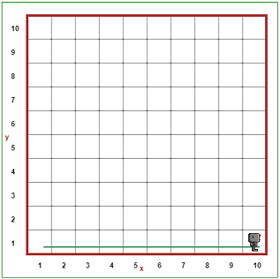
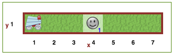

# Introduction to Variable Types

Kudos for finishing the last lesson! Now that we've gotten our feet wet with Python, we already know a lot: how to use the IDLE, how to create a variable, how to print a statement, and how to take user input. If you need a refresher, take a look at the [**Variables Lesson 1**](https://github.com/StreetCodeAcademy/programming-fundamentals/tree/master/python-curriculum/Variables_Lesson1), where we went over these concepts.

# Types of Variables: Numbers and Text

In the previous lesson, we talked about two basic types of variables that we'll be using a lot in Python: **numbers** and **text**. As a refresher, remember that some _number variables_ might look like this:

```python
my_favorite_number = 3.14
your_favorite_number = 7
```

A _text variable_ might look like this:

```python
the_best_place = "StreetCode Academy"
```

Notice that `my_favorite_number` has a decimal point (the period), but `your_favorite_number` doesn't. Why could that be? Well, in Python, we actually have two types of numbers: **decimals** and **integers**. Decimals like 3.2, 9.0, and 1.234 aren't whole numbers, so money (like $4.25) is usually stored as a decimal value. Integers, on the other hand, are whole numbers, like 23, 100, and 5! Since Python automatically detects the type of variable you are storing, you don't need to specify that a variable is storing an **integer** or a **string** (though you might need to in another programming language).

### Exercise 1

See if you can write a program to print `My name is (your name here) and I am (your age here) years old!`, where `name` and `age` are stored as **variables**. Try to solve this without looking at [**Variables Intro**](https://github.com/StreetCodeAcademy/programming-fundamentals/tree/master/python-curriculum/Variables_Lesson1), but go back and review if you need a refresher.

**Hint 1:** When declaring variables, consider what type of variables make sense for storing name and age. How are strings different from numbers?

**Hint 2:** You might need to use the `+` symbol to **concatenate** the parts of the sentence already written for you with the parts stored as variables you have created.

# Another Type of Variable: Booleans

Now we're getting into some fancier programming lingo. Are you ready to sound like a hacker???

Booleans sound weird and scary, but they're really not: booleans are simply variables, just like numbers or text, but instead, they can only store two possible values: either `True` or `False`. That's why we often make boolean variables that have `is` or `has` in the variable name because we can answer these sorts of conditional questions with a True or False.

For example, when we were Reeborg, we had to check `front_is_clear()`. We ask Reeborg the question about whether the front is clear, and the answer can only be yes or no (True or False).

For example, I can make a boolean variable about myself:

```python
juliaIsSuperCool = True
```

# Operators

Now, let's move on to a concept that you might have seen before in math class: operators. Operators are simply symbols like ```+``` and ```=``` that we use to manipulate variables and either change them or ask things about them. Some questions you might ask are:

* What is the sum of these two numbers?
* Are these two text variables equal?
* Which of these variables has a larger number inside?
* Do both of these variables store true? Is only one of them true?

The three main types of **operators** we'll be using are the **assignment** operator (**Hint:** you've been using it already!), **math** operators (like `+` and `-`), and **comparison** operators (like `<` and `>=`).

### Assignment Operator

Assignment operators in Python and many other programming languages appear as the single `=` symbol that you've seen before. You've already seen this operator used when we made new variables!

When I type `name = "Morgan"`, for example, I'm _assigning_ the text value of `"Morgan"` _to_ the variable called `name`. That's why it's called assignment!

#### You'll use assignment whenever you are making new variables.

### Math Operators

Math operators in Python are just like what you've seen in math class. We use math operators when we're working with number type variables. There are four main **math operators** we will be using in our programs:

* ```+``` for **adding** numbers (or text, if you want to be fancy) together
* ```-``` for **subtracting** numbers
* ```*``` for **multiplying** numbers
* ```/``` for **dividing** numbers

These operators are very important, so make sure you are familiar with them! You've used these operators in the [**Variable Checkpoint Exercises**](https://github.com/StreetCodeAcademy/programming-fundamentals/tree/master/python-curriculum/Variables_Checkpoint). If you can't recall them, try to go back and try exercise 1 again.

One reason we care about these operators is because we can use them to change numbers. Remember how we said variables are just like boxes? Well, using what we've learned, we can actually change variables by changing what's inside of those boxes. Let's say you have 3 puppies:

```python
my_puppies = 3
```

But you adopted another puppy today! Now, your variable isn't right anymore. How will we update `my_puppies` to be `4` without making a new variable?  

It turns out you can **re-assign the value** using the `+` operator (note that the plus operator has a different effect on number variables and string variables! Talk to your mentor about why you think that is.):

```python
my_puppies = my_puppies + 1
```

This code does what you would expect. As with regular math, we add 1 to the value of my_puppies (which is 3), resulting in the value 4. This number is assigned as the new value of my_puppies. Sometimes, you might hear programmers refer to adding to a value as **incrementing** a value and subtracting from a value as **decrementing** a value.

Since programmers are notoriously lazy, we created a shorthand for that line of code, which uses a special variant of the `=` **assignment** operator and the `+` **math** operator, called the "plus equals" operator: `+=`. The following line is equivalent to the line above, but it uses the plus equals operator.

```python
my_puppies += 1
```

Using what we've learned so far, this operator isn't too complicated. Here, it takes the `1` on the right side and _adds_ it to the current number stored in  `my_puppies` (which is 3) using the `+` sign. Then, using the `=` sign, it **assigns** this newly calculated number _back to_ `my_puppies`. Now, `my_puppies` is a variable containing `4`.

Here's the really cool part: you can do this SAME thing with ALL of the four **math operators** we listed above!  

#### That means you can use ```+=```, ```-=```, ```*=```, and ```/=``` to re-assign any number variable want.

### Exercise 2

I've made a variable for you called `students_at_streetcode`. Tunde just announced that the number of StreetCode students DOUBLED this year! Figure out how to update `students_at_streetcode` to reflect this. Print this new number to the console.  

You can do this using the long form notation or the shorthand notation (both of which you can reference above). Bonus points if you can do both :).

```python
students_at_streetcode = 120
# Your code here
```

### Comparison Operators

Comparison operators are used for asking questions to compare **number** and **boolean** variables. The operators we'll be using on _numbers_ are:

* ```>``` to ask whether the number on the left side is larger than the one on the right
* ```<``` to ask whether the number on the left is smaller than the one on the right
* ```>=``` to ask whether the number on the left is greater than _or equal to_ the one on the right
* ```<=``` to ask whether the number on the left is smaller than _or equal to_ the one on the right
* ```==``` to ask whether two numbers are equal
* ```!=``` to ask whether two numbers are _not_ equal

The operators we'll be using on _booleans_ are:

* ```and``` to ask if _both_ variables contain ```True```
* ```or``` to ask if _one or both_ variables contain ```True```
* ```not``` to ask the opposite of ```and``` or ```or```

### Exercise 3

This is a lot to be learning all at once, but remember, Python was built so that the programs you type kind of look like English!  

**Hint:** Since we are dealing with comparison operators, the output for each comparison should be either `True` or `False`.  

1. What does this program print?

```python
jack_is_tall = True
jill_is_tall = False
print(jack_is_tall and jill_is_tall) # what does this print?
```

Answer: It would print `False`, right? That's because it's not true that Jack and Jill are both tall.  

2. What does this program print?

```python
my_secret_number = 8
your_secret_number = 200
print(my_secret_number == your_secret_number) # what does this print?
print(my_secret_number < your_secret_number) # how about this one?
```

Answer: Two things will be printed. What will they be? Well, if you answered `False` and `True`, you're right! That's because `my_secret_number` is _not_ equal to `your_secret_number`, so saying `my_secret_number == your_secret_number` is `False`, but it _is_ `True` that `my_secret_number` (which is 8) is less than `your_secret_number` (which is 200). 

> Feel free to practice making several more of these booleans using the operators above if you're curious. But keep in mind we have more practice questions for you to work through.

# If Statements

**A Review...**  
Just like in English, the `if` statement is a condition. If I'm hungry, I will eat. If you're at StreetCode, then you're awesome.  

In programming, the exact same thing happens. An `if` statement checks if some condition is true and executes a certain block of code if the condition is true. An `if...else` statement checks if some condition is true, and executes one block of code if the condition is true and another block of code if the condition is false (notice that we'll be checking for `True` and `False` values, which are booleans!).

Recall how we write an `if` statement:

```python
#A simple if statement
if some_condition is True: #the condition typically compares variable values with a comparison operator
    do something here
    
#An if else statement
if some_condition is True: #the condition typically compares variable values with a comparison operator
    do something here
else:
    do something else instead

#An if elseif statement (useful when we want different behavior for several different conditions)
if some_condition is True: #the condition typically compares variable values with a comparison operator
    do something here
else if another_condition is True:
    do something else different
else if yet another_condition is True:
    do something else totally different
```

As an example, `if` I have less than 5 fish, I will go fishing. Otherwise (or `else`), I will not go fishing. Let's take the fisherman as an example to understand how to use an `if` statement, using a **variable** that we created ourselves. Observe that we're using the comparison operator `<` in the line `my_fish < 5`. Since we're using a comparison operator, this means `my_fish < 5` should resolve to either `True` or `False`. The code directly under the `if` block executes if `my_fish < 5` resolves to `True`. If `my_fish < 5` resolves to `False`, the code directly under the `else` block executes **instead**.

### Exercise 4

What is the value of the `my_fish` variable after the program runs?  

```python
my_fish = 4
if my_fish < 5:
    my_fish += 1 # go fishing
else:
    print("I have 5 or more fish already, so I will NOT go fishing!")
```

Answer: Will the fisherman add a fish here? YES! That's because we go fishing if we have less than 5 fish, which is true (we have 4 fish). We know this because of the value assigned to the variable, `my_fish`.
* Can you guess what would happen if I assigned `my_fish = 10` instead of `my_fish = 4` and ran the code again?

You can use `if` statements on any **condition**, or question you ask. The question (usually set up with a comparison operator) will result in either `True` or `False`. Of course, you can also use the other variants of the if statement (if else, if elseif), which also depend on checking conditions, as described above. Here are some examples of things you could put after an `if`:

* ```my_age > your_age```
* ```i_am_hungry and you_are_hungry```
* ```mi_casa == tu_casa```

Here are some things you can't ask in an `if` statement. Can you identify why? Discuss with your mentor.

* ```my_age```
* ```height = 5```
* ```"I like pie"```
> Go ahead and run through a couple more examples with a mentor here before moving on.  

# Loops

Now we’re going to review two very useful items in our programming toolbox: `while` loops and `for` loops.  

The reason **loops** are called loops is that they do things (run a block of code) over and over again...in a loop! When we want things to happen again and again, we can use two types of loops: `while` and `for` loops.  

## While Loops

While loops are important for doing things over and over again _until_ you reach a point where you want to stop. To put it into plain English, you might say, "while I still haven't reached a wall, keep moving forward." If you recall, this could be replicated in Python in Reeborg's world with the line:

```python
while front_is_clear():
    move()
```

With just the code above, we would be able to get Reeborg to move all the way across an empty board because he will move until ```front_is_clear()``` is false, which is when he hits a wall. After running this loop, the board looks like this:



There are two components of a `while` loop: the **condition**, or the question you ask, and the **code block**, or what you do over and over again (notice that the condition part is similar to the if statement).  

#### The structure of a `while` loop:
#### We have the keyword, `while`, and then a condition (aka a question) we ask, usually with a comparison operator, followed by a colon `:`.
#### Inside the loop, we do whatever write the code that we want to run over and over again until the condition we ask isn't true anymore.

But, now that we know what variables are and how to use them, we can make `while` loops using variables, too. For example, you could have a `while` loop that uses a variable you make, called `my_number`:

```python
# what does this program do?
my_number = 10
while my_number >= 6:
    my_number -= 1
```

Discuss this with your mentor: What does the above loop do? What is the value of my_number once this program is done running?

### Exercise 5

Write a program that asks the user for a `password`, and keeps re-prompting them **until they get it right**. Recall the method for accepting user input is `raw_input()` in Python 2 and `input()` in Python 3. If you're having trouble recalling how this method works, go back to [**Variables Lesson 1**](https://github.com/StreetCodeAcademy/programming-fundamentals/tree/master/python-curriculum/Variables_Lesson1) for a refresher.

**Hint:** What is the condition that you should put in your `while` loop? Which would you use to see if the password the guesser enters is equal to the correct one? Think about using a **comparison** operator. 

## For Loops

The second type of loop, as you'll recall from Reeborg, is the `for` loop (some of you also used the `repeat` syntax for this loop in Reeborg, though in Python, you'll have to use `for` as the keyword). 

When we **know how many times we want to do something**, we can easily use a **for loop** that happens again and again until we tell it to stop.

Below, I've written the code for the `turn_right()` function many of you wrote in Reeborg.  

```python
for i in range(3):
    turn_left()
```

Let’s break the for loop down into its components. First, we have the `for` keyword, which signals that we’re about to enter the loop. Next, we declare a variable that will be used as a "counter" in the loop. The **variable** we declare here, `i`, is commonly used for counting and indexing. In Python, the `in` literally means what you think it does — you are going to make `i` count up (can also cound down), and each time we loop, we check that `i` is still a value *in* that range.

Another important concept is `range`. The `range` function takes up to three parameters.  

The simplest version looks as follows:  

```python
for i in range(number):
    #code block
```

To make the code in the block run 2 times, we'd use `for i in range(2):`. To have it run 10 times, we'd use `for i in range(100):`, and so on...  


#### The structure of a `for` loop:
#### We have the keyword, `for`, and then counter variable (often named i), followed by the keywords `in range`, and a number as the argument in the parentheses.
#### The number specifies the number of times the code block inside the loop runs. Implicitly, the for loop adds 1 to the counter variable (or another number if the third argument is specified) each time the code block runs and the for statement checks whether the counter variable is less than the range argument specified. If the comparison evaluates to True, the loop runs again. If the comparison evaluates to False, the loop exits.

**The Nitty Gritty on For Loops**   

Since i is always initialized to 0 in the beginning, `for i in range(2):`, `i = 0` before entering the loop. Since 0 < 2, the code inside the for loop runs. Once the loop executes one time, `i = 1`. Since 1 < 2, the code inside the for loop runs again. Now, `i = 2`, but 2 < 2 is `False`, so the loop STOPS. 

If we don’t want the i to start from 0, however, we will have to specify the starting number (**inclusive**) and the ending number (**exclusive**) we want. These words carry the same meaning when we talk about ranges of numbers in math class. For example, "x is between 10 and 20, inclusive" in a word problem means that x can take on all numbers between 10 and 20, or 10 or 20.  

In terms of programming and for loops, inclusive means you want i (the counter variable) to take on this value, while exclusive means that you do not want i (the counter variable) to take on this value; it’ll only include the number before it.   
For example, if we specified `for i in range(1, 4):`, i is assigned to store the value 1 initially and increment up 1 each time, with a final value of 3 when the loop stops, since the second parameter, 4, is **exclusive**.  

The for loop actually takes a third parameter, which is the incrementer. It controls **by how much** the counter variable increases or decreases on each execution of the loop. For example, `for i in range(0, 10, 2):` specifies that i is assigned the values 0, 2 (0 + 2), 4 (2 + 2), 6 (4 + 2), 8 (6 + 2), 10 (8 + 2), with each execution of the loop. We can also do super cool things like count backwards, using `for i in range(10, -1, -1):`, which means i takes on the values 10 down to 0 (recall the first argument is inclusive, the second argument is exclusive, the third argument decreases the value of i by 1 on each execution of the loop).

# The Big Picture on If Statements and Loops

## Tab Indents, Code Blocks and Scope
Notice how, whenever we use keywords like `while` or `for` or `if`, there is a **tab indent**. This indentation is how Python recognizes **scope** — if you know other languages like Java or C++, you know that curly brackets, `{}`, are used to define scope. While we won’t go too deep into scope here, what you need to know is that scope dictates what part of the program you’re in, which affects whether programs can understand variable names you use. In this case, the scope of the variable `i` declared in `for i in range():` is inside the `for` loop. Similarly, variables declared/created/initialized _inside_ a loop code block or an if statement code block _will not_ be accessible OUTSIDE of that scope (aka, when the loop or if statement exits). The visual cue will be the tab indent to another level.  

Here, when we indent, we are going one level deeper into our **scope**. Everything you write with this indent will be run *inside of* the loop or if statement, rather than after the loop or if statement has exited (which is when you backspace the indent after you’re done with typing everything want to run inside the loop or if statement). When you backspace your indent, you move out one level of scope, so make sure to keep the indents in line, so your code runs as you intend it to.  

#### It's important to remember, if you declare a variable and use it outside of its, it won’t be recognized.

## While Loop vs. For Loop (Boxing Match)

Discuss this with your mentor the difference between a `while` loop and a `for` loop. How are both related to the `if` statement?

We use `while` loops when we don't know how many times for sure, but we know a **condition for when we want to stop**. If you can say "I want to do something until _____", there's a good chance you want to use a `while` loop.  

We use `for` loops when we **know how many times we want to do something**.  

In some special cases, you can use either kind of loop to solve your probably, but as is the case with many problems, there is often one solution that is more intuitive.  

### Exercise 6

Now that you've learned how `if` statements, `while` loops and `for` loops interact with variables, let's try to apply them to a solve a task.

I don't know about you, but I'm a huge cat fan. Today, I've decided to adopt many cats. In fact, I've decided I want to adopt 100 cats all at once! Every time you adopt one cat, the adoption agency needs to print out the updated number of cats you own to keep a record. So, we'd expect your output to look something like:

```python
You now have 1 cat(s).
You now have 2 cat(s).
You now have 3 cat(s).
...
You now have 100 cat(s).
```

**Hint:** Try to use a `for` loop to solve this problem. Remember that in a for loop, the counter variable is initialized to 0. What tricks can we use to make sure the first number printed out is a 1 instead of a 0? Perhaps a handy math operator?  

**Save this code if you reach a stopping point here, as you'll use it in the following exercise.**

### Exercise 7 (redesigning the while loop)

We learned earlier that `while` loops don't have **counter variables** like `for` loops do. But, it turns out, we can have them keep track of counter variables, if we want them to (recall that I said we can use both kinds of loops to solve certain problems). It's your task to build a `while` loop that has a counter variable that adds 1 every time you go through the loop! Complete **Exercise 6** by using a `while` loop instead of a `for` loop, and compare your code with the code you wrote earlier.

### Exercise 8 (optional)

You're free to move on now, but if you want an extra challenge...

If you did the Reeborg center challenge, do you remember how much work you had to do with dropping smiley faces and picking them back up to solve the problem?



Go ahead and head back to [Reeborg](http://reeborg.ca/reeborg.html) and go to the "Center 1" problem.

Now that you know how to use variables, see if you can design a smarter way to solve this problem that only puts down one smiley face (the one in the middle). 

> **Hint:** You should be able to solve this problem by only going across the world once, then coming back into the center. Think about how you could use a variable to keep track of the width of the world, then combine that with a `for` loop. It's incredible how concise and elegant the solution to this problem becomes when you can use variables.
