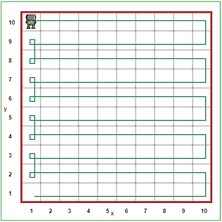

# Introduction to Variable Types

Kudos for finishing the last lesson! Now that we've gotten our feet wet with python, we already know a lot: how to use the IDLE, how to create a variable, how to print a statement, and how to take user input. If you need a refresher, take a look at the [**Variables Lesson**](https://github.com/StreetCodeAcademy/programming-fundamentals/tree/master/python-curriculum/Variables_Lesson1), where we went over these concepts.

# Types of Variables: Numbers and Text

In the previous lesson, we talked about two basic types of variables that we'll be using a lot in python: **numbers** and **text**. As a refresher, remember that some _number variables_ might look like this:

```python
my_favorite_number = 3.14
your_favorite_number = 7
```

A _text variable_ might look like this:

```python
the_best_academy = "StreetCode Academy"
```

Notice that `my_favorite_number` has a decimal point (the period), but `your_favorite_number` doesn't. Why could that be? Well, in python, we actually have two types of numbers: **decimals** and **integers**. This might sound complicated, but it really isn't, so don't worry! Basically, decimals like 3.2, 9.0, and 1.234 aren't whole numbers, so money (like $4.25) is usually stored as a decimal value.

Integers, on the other hand, are whole numbers, like 23, 100, and 5! That means you'll never use periods with integers. Pretty easy to remember, right? Integers take up less space in the computer than decimals, so when we don't need to use decimals, we use integers. Integers are often useful for counting, which we'll soon see when we are counting the number of times we go through a loop.

## Your turn! Try it out:

Try printing some statements that involve integers, decimals, and strings. See if you can print these statements without looking at the previous material!

The challenge: get your program to print ```My name is (your name here) and I am (your age here) years old!``` 

The catch: your name and your age must be stored as variables: ```name``` and ```age```.


# Types of Variables: Booleans

Now we're getting into some fancier programming lingo. Are you ready to sound like a hacker???

Booleans sound weird and scary, but they're really not: booleans are simply variables, just like numbers or text, but instead, they can only store two possible values: either ```True``` or ```False```. That's why we often make boolean variables that have ```is``` or ```has``` in them because we use them to answer questions we might have.

For example, when we were Reeborg, we had to check ```frontIsClear```. We ask Reeborg the question about whether the front is clear, and the answer can only be yes or no. That's why it's good to have boolean variables, because we can ask simple questions and get simple answers.

For example, I can make a boolean variable about myself:

```python
juliaIsSuperCool = True
```


# Operators

Now, let's move on to a concept that you might have seen before in math class: operators. Operators are simply symbols like ```+``` and ```=``` that we use to manipulate variables and either change them or ask things about them. Some questions you might ask are:

* What is the sum of these two numbers?
* Are these two text variables equal?
* Which of these variables has a larger number inside?
* Do both of these variables store true? Is only one of them true?

The three main types of **operators** we'll be using are the **assignment** operator (hint: you've been using it already!), **math** operators (like ```+``` and ```-```), and **question** operators (like ```<``` and ```>=```).

### Assignment Operator

Assignment operators in python and many other programming languages appear as the single ```=``` symbol that you've seen before. You've already seen this operator used when we made new variables!

When I type ```name = "Morgan"```, for example, I'm _assigning_ the text value of ```"Morgan"``` _into_ the variable called ```name```. That's why it's called assignment!

You'll use assignment whenever you are making new variables.


### Math Operators

Math operators in python are just like what you've seen in math class. There are four main **math operators** we will be using in our programs:

* ```+``` for **adding** numbers (or text, if you want to be fancy) together
* ```-``` for **subtracting** numbers
* ```*``` for **multiplying** numbers
* ```/``` for **dividing** numbers

These operators are very important, so make sure you are familiar with them! Take a moment now with your mentor to practice what you expect the following code to print by thinking about what these operators do:

```python
my_age = 20
your_age = 5
our_ages = my_age + your_age
print(our_ages)
print(my_age - your_age)
print(our_ages / your_age)
print(your_age * 2)
```

One reason we care about these operators is because we can change numbers. Remember how we said variables are just like boxes? Well, using what we've learned, we can actually change variables by changing what's inside of those boxes. Let's say you have 3 puppies:

```python
my_puppies = 3
```

But you adopted another puppy today! Now, your variable isn't right anymore. How will we update ```my_puppies``` to be ```4``` without making a new variable? It turns out you can use another special type of **assignment** using the ```+=``` operator:

```python
my_puppies += 1
```

Using what we've learned so far, this operator isn't too complicated. Here's all it's doing, in two simple steps: it takes the ```1``` on the right side and **adds** it to the current number inside ```my_puppies``` using the ```+``` sign. Then, using the ```=``` sign, it puts this new number **back into** ```my_puppies```. Now, ```my_puppies``` is a variable containing ```4```.

This is the exact same thing as writing:

```python
my_puppies = my_puppies + 1
```

Here's the really cool part: you can do this SAME thing with ALL of the four **math operators** we listed above! That means you can use ```+=```, ```-=```, ```*=```, and ```/=``` to change any number variable you want. Give it a try now!

#### Your turn! Try it out:

I've made a variable for you called ```students_at_streetcode_2017```. Your challenge: Tunde just announced that the number of StreetCode students DOUBLED this year! Make a new variable called ```students_2018``` that has double the number inside ```students_at_streetcode_2017```.

```python
students_at_streetcode_2017 = 120
# Your code here
```


### Question Operators

Question operators are used for asking questions about **number** and **boolean** variables. The operators we'll be using on _numbers_ are:

* ```>``` to ask whether the number on the left side is larger than the one on the right
* ```<``` to ask whether the number on the left is smaller than the one on the right
* ```>=``` to ask whether the number on the left is greater than _or equal to_ the one on the right
* ```<=``` to ask whether the number on the left is smaller than _or equal to_ the one on the right
* ```==``` to ask whether two numbers are equal
* ```!=``` to ask whether two numbers are _not_ equal


The operators we'll be using on _booleans_ are:

* ```and``` to ask if _both_ variables contain ```True```
* ```or``` to ask if _one or both_ variables contain ```True```
* ```not``` to ask the opposite of ```and``` or ```or```

#### Your turn! Practice reading these operators:

This is a lot to be learning all at once, but remember, python was built so that the programs you type kind of look like English! So, for example, what do you think this would print out?

```python
jack_is_tall = True
jill_is_tall = False
print(jack_is_tall and jill_is_tall) # what does this print?
```

It would print ```False```, right? That's because it's not true that Jack and Jill are both tall. Let's try another:

```python
my_secret_number = 8
your_secret_number = 200
print(my_secret_number == your_secret_number) # what does this print?
print(my_secret_number < your_secret_number) # how about this one?
```

Two things will be printed. What will they be? Well, if you answered ```False``` and ```True```, you're right! That's because ```my_secret_number``` is *not* equal (```!=```) to ```your_secret_number```, but it **is** true that ```my_secret_number``` is less than ```your_secret_number```. 

> Feel free to practice making several more of these booleans using the operators above if you're curious.


# If Statements and Loops

Now that we have learned about types of variables and operators, we can start doing cool things with them! The first thing we're going to review is the ```if``` statement, but with a twist: we're going to use variables in them.

## If Statements

Just like in English, the ```if``` statement is a condition. If I'm hungry, I will eat. If you're at StreetCode, then you're awesome. In programming, the exact same thing happens: ```if``` something is true, then do something else. For example, ```if``` I have less than 5 fish, I will go fishing. Otherwise (or ```else```), I will not go fishing. Let's take the fisherman as an example to understand how to use an ```if``` statement, using a **variable** that we created ourselves:

```python
my_fish = 4
if my_fish < 5:
    my_fish += 1 # go fishing
else:
    print("I have 5 or more fish!")
```

Will the fisherman add a fish here? YES! That's because we go fishing if we have less than 5 fish, which is true. We know this because of our variable, ```my_fish```. Recall how we write an ```if``` statement:

```python
if some_condition is True:
    do something here!!!
else:
    do something else instead!
```

You can use ```if``` statements on any **condition**, or question you ask. The question will result in either ```True``` or ```False```, and if it's true, you'll do what's in the ```if``` statement, and if it's not true, it'll do what's in the ```else``` block. Here are some examples of things you could put after an ```if```:

* ```my_age > your_age```
* ```i_am_hungry and you_are_hungry```
* ```mi_casa == tu_casa```

Here are some things you can't ask in an ```if``` statement. Can you identify why? Discuss with your mentor.

* ```height = 5```
* ```my_age```
* ```"I like pie"```

**Go ahead and run through a couple more examples with a mentor here before moving on.**

## Loops

Now we’re going to revisit two very useful items in our programming toolbox: ```while``` loops and ```for``` loops.

To be a good programmer, we need to make efficient programs, and that means knowing how to best store and manipulate our data.

The important question we’ll be answering is: What if we want some of our commands to happen more than once? (That’s where loops come in!)

The reason **loops** are called loops is that they do things over and over again...in a loop! When we want things to happen again and again, we can use two types of loops: ```while``` and ```for``` loops. Let's take a look at ```while``` loops first.

### While Loops

While loops are important for doing things over and over again until you reach a point where you want to stop. To put it into plain English, you might say, "while I still haven't reached a wall, keep moving forward." This is the same thing as saying, "keep moving forward until I hit a wall." A ```while``` loop can make this easy!

There are two components of a ```while``` loop: the **condition**, or the question you ask, and the **command**, or what you do over and over again. Here's what it looks like in action:

```python
while front_is_clear():
    move()
```

That's all there is to it! Make sure to remember how, just like with an ```if``` statement, we have the keyword, ```while```, and then a question (or condition) we ask Reeborg the robot, and then a colon ```:```, and inside the loop, we do whatever we want to do over and over until the condition we ask isn't true anymore.

With just the code above, we would be able to get Reeborg to move all the way across an empty board because he will move until ```front_is_clear()``` is false, which is when he hits a wall. After running this loop, the board looks like this:


This should look pretty familiar. But, now that we know what variables are and how to use them, we can make ```while``` loops using variables, too. For example, you could have a ```while``` loop that uses a variable you make, called ```my_number```:

```python
# what does this program do?
my_number = 10
while my_number >= 6:
    my_number -= 1
```

Discuss this with your mentor: what does the above loop do? What is the value of my_number once this program is done running?

### Your turn! Write a program that asks for a password:

Your challenge is to use the tools in your toolbox to write a program that asks the user for a ```password```, and keeps re-prompting them **until they get it right**. Recall the syntax for accepting user input:

```python
word = input("Give me a word! ")
```

This program stores the text that the user types into the variable ```word```.

> Hint: What is the condition that you should put in your ```while``` loop? What needs to happen for the word the user types to be the correct password? Think about using an operator. Which would you use to see if the password they enter is equal to the correct one?


### For Loops

The second type of important loop, as you'll recall, is the ```for``` loop. Remember how it's easy for us to get Reeborg to move by writing

```python
while front_is_clear():
    move()
turn_left()
```

And then copying and pasting that text again and again to have Reeborg move around the board. This works for short programs, but there's a problem. Imagine if he needed to do that 100, 1000, or 10000 times! That would be way too time-consuming to type (or even copy-paste), and it’s very inefficient.

When we **know how many times we want to do something**, we can easily use a **for loop** that happens again and again until we tell it to stop. Inside of this loop, we can use a **counter variable** that changes each time, and we’ll use that changing variable to display how many fish we currently have.

Below, I've written the code that will let Reeborg move across the entire 10 x 10 board by going across every row! Don't worry if it looks difficult to understand; we're going to break it down line by line.

```python
for i in range(5): # i is called a "counter variable"
    while front_is_clear():
        move()
    turn_left()
    move()
    turn_left()
    while front_is_clear():
        move()
    for i in range(3):
        turn_left()
    move()
    for i in range(3):
        turn_left()
```

Let’s break the for loop down into its components. First, we have the ```for```, which signals that we’re about to enter the loop. Next, we declare a variable that will be used as a counter in the loop. The **variable** we declare here, ```i```, is commonly used for indexing arrays. In Python, the ```in``` literally means what you think it does—you are going to make ```i``` loop over some range of numbers or elements of a list (which we’ll discuss later), and each time we loop, ```i``` will be a value *in* that list of numbers or elements.

Another important concept is ```range```. The ```range``` function requires one or two parameters. If you use ```range(2)```, for example, python creates a list of numbers starting from 0, adding each time by 1, and having the total length of the number you gave it. So, for example, ```range(2)``` would create the list [0, 1], since there are two elements and it starts counting from 0.

If we don’t want the list to start from 0, however, we will have to specify the starting number (**inclusive**) and the ending number (**exclusive**) we want. Inclusive means you want this number in the list itself, while exclusive means that you don’t count this number in the list; it’ll only include the number before it.

If we specified ```range(1, 4)```, we would want our list to start from 1 and end at 3, since the second parameter, 4, is exclusive. So, our list will end up being [1, 2, 3] and we will loop over those values of ```i```.

Now, let's enter the loop!

```python
for i in range(5):
    while front_is_clear(): # notice the tab indent in this line!
        move()
    turn_left()
    move()
    turn_left()
    while front_is_clear():
        move()
    for i in range(3):
        turn_left()
    move()
    for i in range(3):
        turn_left()
```

Notice how, in the second line of our program, there is a **tab indent**. This indentation is how python recognizes **scope**—if you know other languages like Java or C++, you know that curly brackets, ```{}```, are used to define scope. While we won’t go too deep into scope here, what you need to know for this lesson is that scope dictates what part of the program you’re in, which affects whether programs can understand variable names you use. In this case, the scope of the variable ```i``` is inside the for loop. If you declare the variable and use it outside of this loop, it won’t be recognized.

Here, when we indent, we are going one level deeper into our **scope**. Everything you write with this indent will be run *inside of* the for loop, rather than after the entire loop has finished (which is when you backspace the indent after you’re done with typing everything want to run inside the loop). When you backspace your indent, you move out one level of scope, so make sure to keep the indents in line for good style, functionality, and readability.

Everything after line 2 will be run again and again for the number of times we told Reeborg, which is 5. So, we'll be running the inside of the program 5 times.

#### Your turn! Figure out the code:

Much of the code after the first line of the for loop should look familiar to you. We're using a ``while`` loop to move until Reeborg hits a wall, and we're using ```for``` loops to turn left a certain number of times that we want Reeborg to turn (in this case, 3). Can you figure out why we need to run this code 5 times to have Reeborg run across the entire board?

> Hint: Look at the final state of Reeborg in the While Loops section above. What code did we use to get there? How does that code relate to this code?
>
> Another Hint: The final state of Reeborg after running this code is:



> Extra Hint: It turns out we need to make Reeborg move across two rows before repeating the entire process. The code inside the loop is making Reeborg move across two rows. Which statements get Reeborg to move across the first, and then the second row?

### Important Point

It's important that we understand the difference between a ```for``` loop and a ```while``` loop. Discuss this with your mentor, as this is a crucial point! We use ```for``` loops when we **know how many times we want to do something**.

We use ```while``` loops when we don't know how many times for sure, but we know a **condition for when we want to stop**. If you can say "I want to do something until ___", there's a good chance you want to use a ```while``` loop. Make sure you understand this distinction, because you'll need it later!

### Your turn again! Let's build a broken record:

Now that you've learned how ```if``` statements, ```for``` loops, and ```while``` loops interact with variables, let's try to build a broken record that says the same thing all the time...well, almost.

Let's pretend that you're a HUGE cat fan, and you're adopting a ton of cats today. In fact, you're adopting 100 cats all at once! Every time you adopt one cat, the adoption agency needs to print out how many cats you have total. So, we'd expect your output to look something like:

```python
You now have 1 cat(s).
You now have 2 cat(s).
You now have 3 cat(s).
...
You now have 100 cat(s).
```

Work with your mentor and use a ```for``` loop to create a program that will print out these 100 statements. **Save this code, as you'll use it in an exercise further down on this page!**

### Now, let's mix it up and loop over a list:

Although we haven't covered this directly in our lessons so far, this is a great chance for us to interact with another kind of variable: a list. We're going to supply you a name of all the cats you got, and you just need to print them all out, one by one. The syntax for this is:

```python
for cat in list_of_cats:
    # your code here
```

This is almost exactly what you've done before, with two differences: ```i``` turned into ```cat```, and ```range(100)``` turned into ```list_of_cats```. Behind the scenes, python is doing the same thing, though; ```cat``` is a variable that represents the cat name you are currently printing, and ```list_of_cats``` is a list of all the possibilities you need to look at, which is the same thing as a list of numbers from 1 to 100, which is what you were using earlier with ```range()```! Check in with your mentor to make sure this makes sense.

You can copy this statement here that creates the list of cats into the very beginning of your program, since we haven't covered lists yet:

```python
list_of_cats = ["Joe", "Lily", "Sammy G", "Nyan", "Mimi", "Sally", "Heidi", "Jones"]
```

### Redesigning the while loop

We learned earlier that ```while``` loops don't have **counter variables** like ```for``` loops do. But, it turns out, we can *force* them to have counter variables, if we want them to. It's your task to build a ```while``` loop that has a counter variable that adds by 1 every time you go through the loop! Complete the "broken record" task above by using a ```while``` loop instead of a ```for``` loop, and compare your code with the code you wrote earlier.

### An additional extravaganza!

In this exercise, you're going to build a program that gets users to input numbers, and you're going to **add all of the numbers up and print out the sum** every time they input another number. For example, if the user inputs 1, then 2, then 3, then you're going to print out 1, then 3, then 6. Print out the sum immediately after the user inputs each number. End your program when the user inputs a 0. You can assume that none of the numbers are less than 0 (but you can check for that if you'd like an extra challenge)!

If you're having trouble with getting python to see the user inputs as **integer numbers**, try the following command:

```python
number = int(input("Enter a number: "))
```

The ```int()``` command forces the input to be converted into a number.


# And...Onward!

Fantastic job!! You've just learned about the combination of different kinds of variables with different types of loops, the ```if``` statement, and different types of commands and questions (operators) that you can use to make your programs a lot more powerful.

Onward to the [checkpoint exercise](https://github.com/StreetCodeAcademy/programming-fundamentals/tree/master/python-curriculum/guessing_game_checkpoint), where you'll build an interactive *guessing game*!