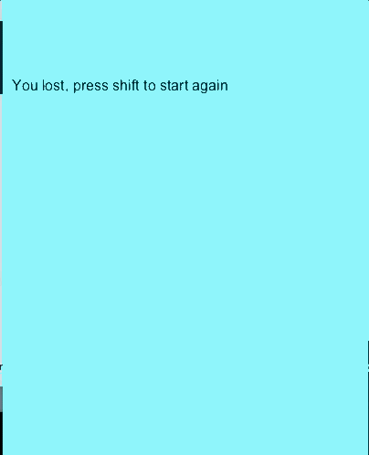

# Flappy Bird

**To start this lesson, students should:**

- Be familiar with key events lesson
- Understand object collision

**By completing this lesson, students will learn:**

- How to create a simple game
- How to use starter code

## Introduction

Today we are going to be creating a game called Flappy Bird! I'm sure a lot of you have already seen this game. If not, below is an example

## Goals

Before we start coding, let's look at some of the rules of flappybird.

 - If the bird hits the pipe, it dies
 - If the bird hits the floor, it dies
 
## Starter Code

There should be a file called flappyBirdStarterCode. Open it and copy and paste the code into processing. You will notice several parts. Let's walk through them

### Before setup

You will notice this huge block of code

	gravity = 2
	xPos = 50
	yPos = 250
	birdWidth = 20
	birdHeight = 20
	minHeight = 50
	pipeWidth = 50
	pipeXPos = 500
	heightTopPipe = 200
	heightBottomPipe = 200
	spaceBetweenPipes = 100
	pipePassed = True
	stopGame = False
	f = None
	
What these are, are variables. They are before setup because we are going to use them a lot. Please do not modify the initial values for ANY of these variables. Let's walk through each variable. 

	gravity = 2

The gravity controls how fast the bird will fall to the ground, we can fiddle with this variable later. We will be using this variable to have the bird fall.

	xPos = 50
	yPos = 250

This is the original position of the bird. The xPos will always be the same, but the bird's y position will change.

	birdWidth = 20
	birdHeight = 20

These two variables control the size of the bird. They should not be changed in any part of the code, but they will be used to draw the bird (as an ellipse).

	minHeight = 50
	pipeWidth = 50
	pipeXPos = 500

These variables control the pipe's dimensions. The minHeight means the pipe will always be at least 50 pixels high. pipeWidth controls the width of the pipe. pipeXPos is the starting position of the pipe. Note  we will be making the pipe move left, so we will be changing the x position. 

	heightTopPipe = 200
	heightBottomPipe = 200
	spaceBetweenPipes = 100
	
These variables will control the height of the top and bottom pipe. Each time the pipes pass by the view window, `pipeCreate()` will be called to reassign a random value to heightTopPipe, from which heightBottomPipe can be computed.

	pipePassed = True
	stopGame = False
	
These variables initialize states for pipePassed and stopGame. You'll be flipping these states by checking for various conditions throughout your code. They will control when `pipeCreate()` is called and when the view window will display the game over screen.

	f = None
	
This variable holds an initial state for the font variable. It will hold a font object after `setup()` is called. You do not need to alter this variable, since it is only used for the game over screen. The code for displaying the game over screen has already been implemented for you.
	
### Setup

Let's look at the setup code
	
	def setup():
	    global f
	    size(400,500)
	    f = createFont("Arial",16)
	
Nothing too exciting, just sets up the screen. You won't be modifying this code so you can leave it alone. You will notice this "f". Don't worry about it, it is just there so we can code a game over screen. 

### Draw

Now let's look at the draw code.

	def draw():
	    global yPos,stopGame,f
	    background(125,236,248)
	    if stopGame == False:
	        moveBird()
	        pipeMove()
	        endGame()
	    else:
	        textFont(f,16)            
	        fill(0)                                                
	        text("You lost, press shift to start again",10,100)
	        if keyPressed: 
	            if keyCode == SHIFT:
	                stopGame = False
  
What is this?? There is so many lines! Let's breakdown the lines. 

	global stopGame, f
	

These lines, introduce the global variables. Don't remember what global variables are? Look back at processing lesson 2.

	background(125.236.248)
	
    
The line above changes the background color. 

	if stopGame == False:
	        moveBird()
	        pipeMove()
	        endGame()

If the game is supposed to continue, it will. This line moves the bird and the pipe but also checks to see if the game is supposed to end. 

	else:
	        textFont(f,16)            
	        fill(0)                                                
	        text("You lost, press shift to start again",10,100)
	        if keyPressed: 
	            if keyCode == SHIFT:
	                stopGame = False
	                

This line deals with what should happen if the game should end. 

### pipeCreate()

We want this section to create the pipes. Now we are going to do a little math. So we want the hole between the pipes to be 100 pixels. We also want both the top pipe and the bottom pipe to be at least 50 pixels tall. So we want the top pipe to be a random height. 

    spaceBetweenPipes = 100
    maxHeightTopPipe = height - spaceBetweenPipes - minHeight
    heightTopPipe = random(50,maxHeightTopPipe)
 
This piece of code randomizes the height for the top pipe. Now that I have given you the code for this part, let's make the bottom pipe.

The bottom pipe's math is a bit easier. Keep in mind we should have the height of the top pipe and the space in between, so it's just a matter of using math to find the height of the bottom pipe. 

### pipeMove()

We want the pipe to move to the left. So we to change the x position and move the pipe to the left. 

### pipePass()

This section checks to see if the pipe we created has moved all the way to the left, and if it has, we want to create a new pipe. Use a global variable to keep track of when the pipe is gone. 

### moveBird()

Moves the flappy bird. Since we have gravity, the bird should fall and should jump if the SHIFT key is pressed. Try to remember keyEvents. 
 
### endGame()

If the bird hits the pipe or the ground, the game should end. This will deal with object collision so review the object collision portions. 

 
### Tips and tricks

There are several concepts that you need to understand if you are going to finish this game.

Key concepts

 - Key events (Lesson 2)
 - Collisions (Lesson 3)
 - Velocity (Lesson 3)
 
 

**Challenges**

If you finished the game, here are some challenges you can do.

- Score system
- Multiple pipes
