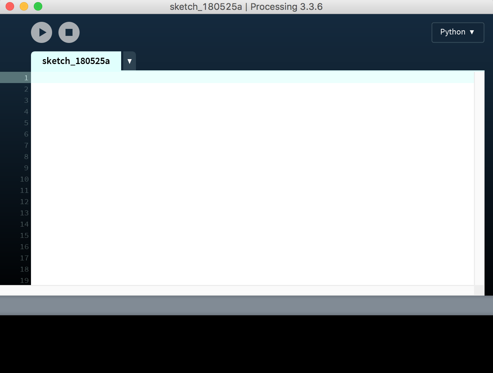
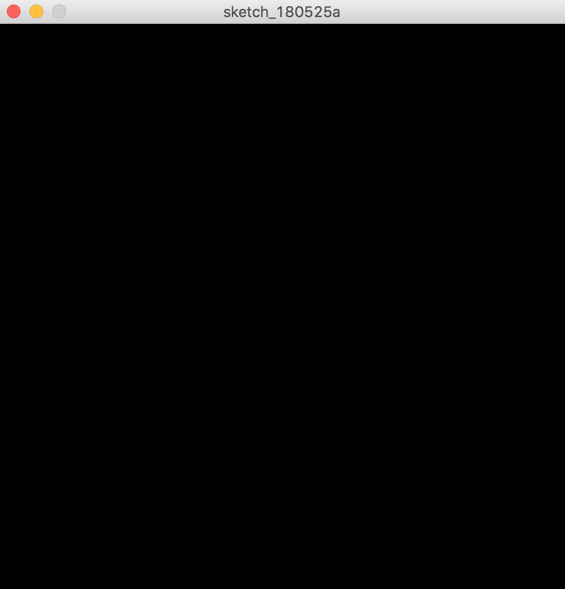
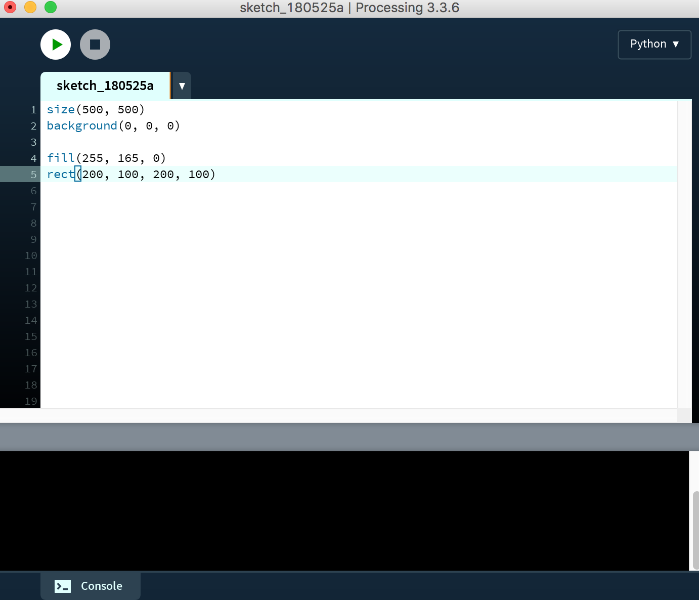
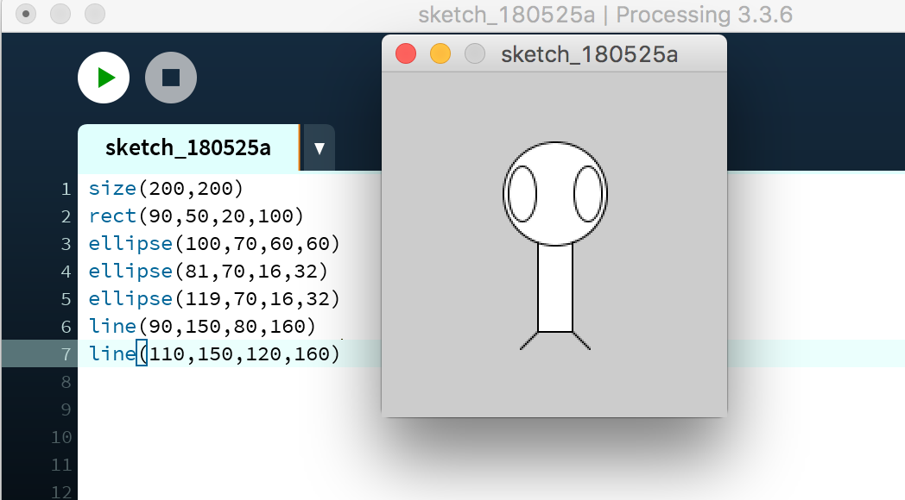
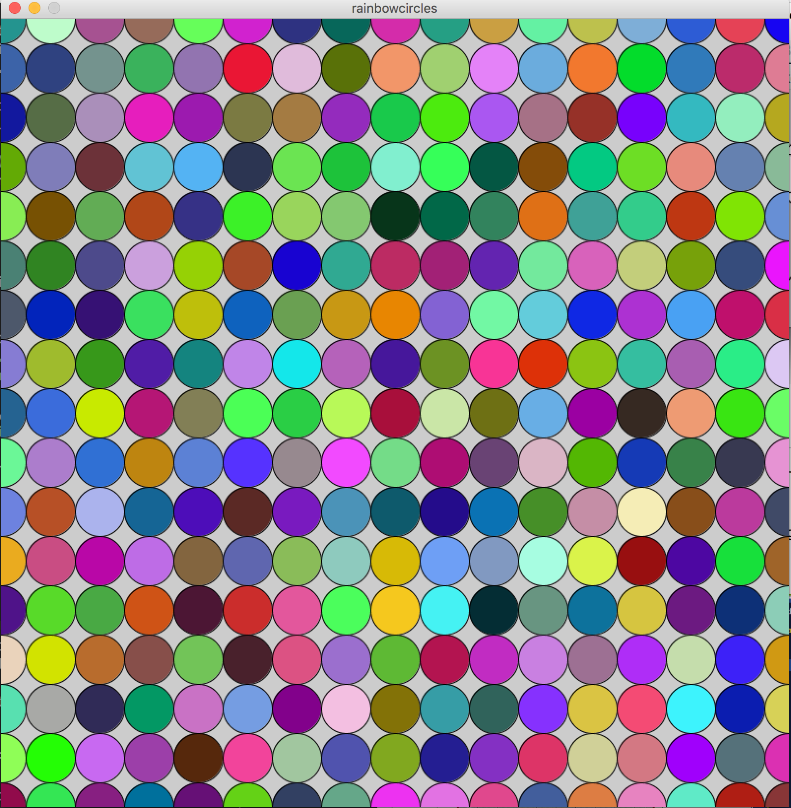
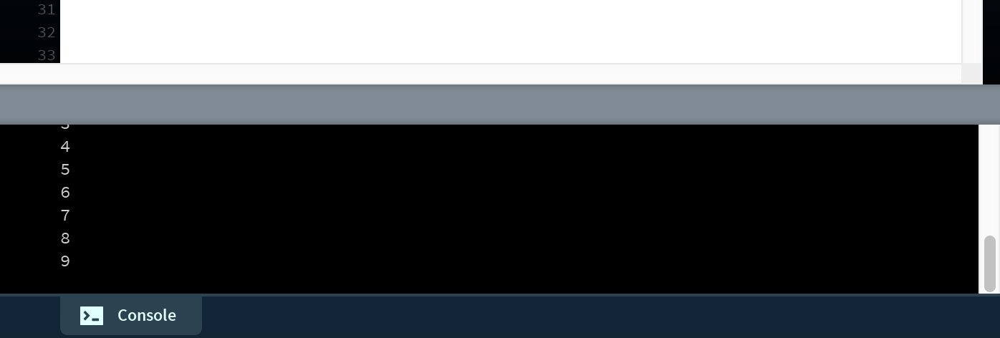

# Getting Started with Processing

##### To start this lesson, students should:

- Be familiar with coordinate systems.
- Have familiarity and experience using variables.
- Have familiarity and experience using functions.

##### By completing this lesson, students will:

- Become familiar with Processing.
- Learn how to draw shapes in Processing.
- Become familiar with the computer coordinate system.

## Setting up Processing with Python

### Make sure Processing is installed

Check if processing is installed on your computer. If it isn't you can download it [here](https://processing.org/download/). Feel free to ask a mentor for help with this.

Processing doesn't include support for the Python programming language by default. In order to enable Python support, you'll need to install an add-on called Python Mode. You can do this by clicking on the drop-down menu on the right side of the tool bar and selecting "Add Mode..." A window with the title "Mode Manager" will appear. Scroll down until you see "Python" and press "Install." 

To see instructions for this in more detail, you can look [here](https://github.com/jdf/processing.py#python-mode-for-processing).

>Note: Before starting make sure it says Python, not java, in the top right corner 

### Let's get started
Go ahead and open processing. You should see a screen like this:

This is the window where we'll write all our code.

Add the following lines of code to the white text area:

    size(500, 500)
    background(0, 0, 0)
    
then his the run button - the button with the triangle on it. You should see something like this.

If you get any errors here, ask a mentor for help. Otherwise, you're ready to get started!

## Drawing Shapes in Processing
### Drawing your first shape
Go ahead and add these lines of code below to the bottom of your code.

    fill(255, 165, 0)
    rect(200, 100, 200, 100)

Now, your code should now look something like this:

If you run your code now, you should see something like this:

Let's go ahead and dive into how the code works for this:

``rect(200, 100, 200, 100)``

What does this first line of code mean?

If you look at the documentation for this function [here](http://py.processing.org/reference/rect.html), (you can find more documentation [here](http://py.processing.org/reference/) if you're curious), you'll notice that each of the numbers in the parentheses control a different aspect of the rectangle we made.

Specifically in this order:

``rect(x, y, width, height)`` 

Which means that:

- x = 200
- y = 100
- width = 200
- height = 100

All of these numbers are what we call in computer science, **parameters**. We'll go more in depth on those later, but for now you have a fancy word you can use to impress people at the dinner table. 

> If you're confused about the y coordinate, don't worry - we'll explain that in a bit.

Note that the x and y start from the upper left corner of the rectangle.

Now how about the first line?

``fill(255, 165, 0)``  

If you didn't guess already, this line of code controls the color of the rectangle. The [fill](http://py.processing.org/reference/fill.html) function includes 3 numbers: the red, green and blue value. Each value is a number value between 0 and 255.

Pretty much, each of these three numbers determine how much red, green, and blue go into the color. You can read more about how this works in processing [here](http://py.processing.org/tutorials/color/) if you're curious.

## Computer Coordinate Systems
As you're looking through all these numbers, if you've learned geometry before, the y coordinate might have been a bit confusing.

That's because in computer coordinates, y increases from top to bottom, meaning that the top of the screen is where y = 0, then the bottom of the screen would be the largest y value.

You can read more about this [here](http://py.processing.org/tutorials/drawing/) if you're curious. Feel free to talk this through a mentor more until it makes sense.

## Practice!

To get more familiar with the coordinate system, go ahead and make some more shapes using rect.

Once you have the handle on that, you can try to add some [ellipses](http://py.processing.org/reference/ellipse.html) and [lines](http://py.processing.org/reference/line.html) as well. 

> You'll notice that we provide many links to information from the [online reference manual](http://py.processing.org/reference/). Definitely feel free to explore this more on your own to figure out how to do even more things or look at this on your own whenever things aren't working and you're trying to figure out why.

Here's an example of a little stick figure you could make and the code that goes with it.

## Combining drawing with loops

Check out this drawing I made in processing:

Okay, if you tried to make the example above using only what we learned so far, it might take you hundreds of lines of code.

What if I told you that I was able to make that drawing using only around 4 lines of code?

Do you remember using for loops in Reeborg?

Go ahead and try adding this to your code.

    for i in range(10):
    	print(i)
    

Then you should see the numbers 0-9 in increasing order print out on the bottom of your screen like this:

That's because when we run the code with the for loop, the i in the for loop will actually be a variable that counts up as it repeats the loop. Go ahead and talk this over with a mentor.

Go ahead and talk through this with a mentor if it doesn't make sense. Go ahead and try out the following examples in your own code - see if you can predict what will print out before it prints!

    for i in range(3, 20):
    	print(i)
###  ###
    for i in range(9):
    	print(i * 5)

Alright, now let's try something different. What happens if you add this to your code?

    fill(0, 0, 255)
    for x in range(33):
    	ellipse(x * 20, 100, 20, 20)

If you pop that into your code and run it, you should see something like this:

Go ahead and talk with a mentor and see if you can figure out how this is working.

### Your Turn!
Okay, here's a challenge. See if you can create something that looks like this:

### Bonus Challenge
Once you finish that, if you want a challenge, see if you can create something like this:

> Hint: How could you repeat the code you created in the earlier part, and have it run multiple times with different x values?

### Bonus Bonus Challenge

If you want to have some fun, see if you could figure out how to do this?

>Hint: You can also make your own color using fill(R,G,B) where you substitute R, G, and B with different Red, Green, and Blue values ranging from 0-255.
>
>If you do some quick Googling, you can figure out how to combine that with random numbers - try googling something like "python random numbers".

Anyways, that's it for this lesson!

>Note to mentors: if your student is interested and you think it would be helpful, feel free to show them a bit about how to combine drawing with functions.

