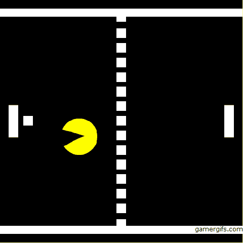
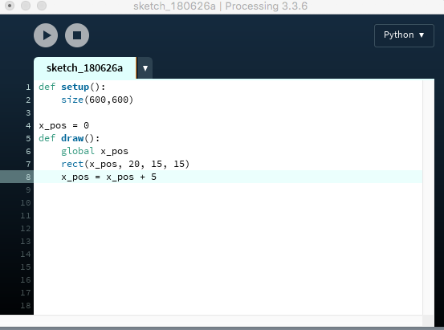
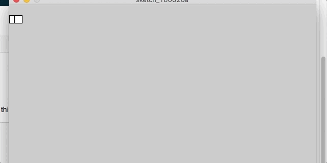
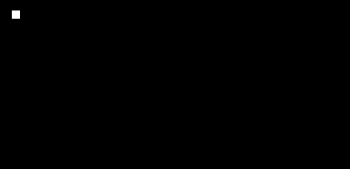
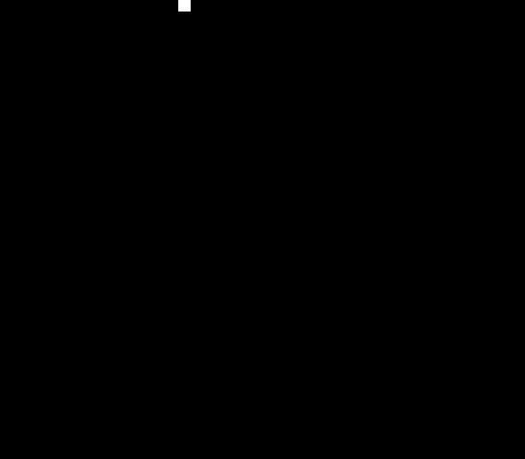
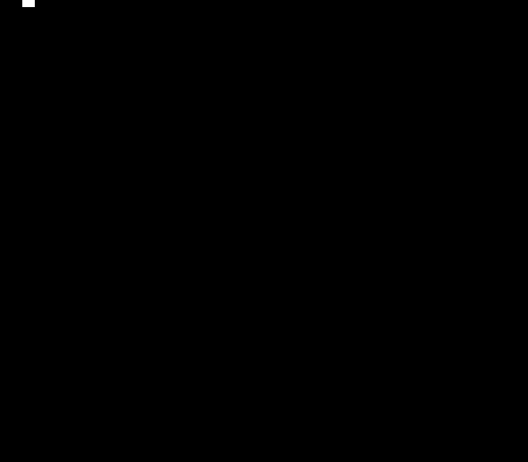

# Events in Processing

**To start this lesson, students should:**

- Be familiar with if statements, while loops, and functions
- Have some practice/famliarity with Processing's coordinate system and how to draw shapes in Processing

**By completing this lesson, students will learn:**

- How to check for keyboard events
- How to check for mouse events
- How to move shapes on the screen

## Introduction
In the last lesson, you learned how to draw colorful shapes on the screen using pygame. In this lesson, we're going to learn how to make your game interactive and animated. 

Using these skills, you'll be able to build things like this!

or this!

> Note: the above image was actually built using processing. You can see more cool art people have built with processing [here](https://www.openprocessing.org/browse/#).
 
## Animations

### Setup
Let's start with the setup of your program.
Go ahead and add these lines to your code:

    def setup():
    	size(600, 600)

The setup function holds all the code we want to run right when the program starts - ie: all the setup. You can read more about it [here](http://py.processing.org/reference/setup.html).
 
### Introducing the Draw Loop

Let's get to the interesting part: The [draw loop](http://py.processing.org/reference/draw.html). This allows us to add animation to our project. The way that the draw loop works is that all the code inside of it will keep repeating roughly 60 times per second.

Let's try an example. Try adding this to your code.

	def draw():
		print("StreetCode is awesome!")

When you run it, you should see something like this:

This is because the code: 

	print("StreetCode is awesome!")
	
is getting repeated over and over since it is in the draw loop.

### The Draw Loop with Variables

Let's try a different example. Try replacing the code you just wrote with this.

	x = 0
	
	def draw():
		global x
		print(x)
		x = x + 1
		
Before you run that, let me explain the line:

	global x
	
This probably doesn't make sense at the moment. What this line of code is doing is telling the code below it in the draw function to treat the variable, x, as a **global variable**. You can read about what global variables are [here](http://py.processing.org/reference/globals.html). Make sure to talk it over with a mentor if it doesn't make sense because we'll be using these a lot.

Before you run your code, see if you can figure out what it will print, then go ahead and run it.

Were you right? Talk with a mentor and see if you can make sense of what happened.

### Putting it together to animate shapes

Okay, now for the cool part. Try replacing the code you had with this:

	x_pos = 0
	def draw():
	    global x_pos
	    rect(x_pos, 20, 15, 15)
	    x_pos = x_pos + 5
	    
Your code should now look something like this: 

When you run it, you should see something like this:

Great! Now we have a square moving, but what's up with the trail of squares left behind by it? 

This is because the screen doesn't automatically refresh each time - anything you draw just gets added to what's already been drawn! To get rid of that, we'll need to add this line of code to our draw function:

	background(0,0,0)
	
This works because the `background` command will cover the whole screen in a background, eliminating the past drawings left from previous frames.

If you run it now, you should see something like this:

> Note: you can try messing with the numbers in the `background` function and see what happens. Read more [here](http://py.processing.org/reference/background.html) to find out more about how that function works.

Awesome! We have our moving square. If you remember the [fill](http://py.processing.org/reference/fill.html) function from last lesson, you can try messing with the color of the square as well.

Why does this all work? If you remember in the previous examples, since the `draw` loop repeats over and over and is adding to the variable, `x_pos` each time. This causes the square to get drawn further to the right each time since the variable, `x_pos` , controls the x position of the square.

Go ahead and talk this over with a mentor or partner if it doesn't make sense.

### Your turn!

We just walked together through the process of making a square move to the right. Now, see if you can make the square move downwards instead.

After that, you can try diagonal.

That's it! Feel free to move on to the Keyboard Events section, or try some of the challenges if you're up for it.

#### Challenges: 

- Try to move multiple shapes at once but at different speeds
- Make a finish line (draw a new long skinny rectangle), and have the box stop at the finish line

## Keyboard Events
Alright, now we've learned how to make objects on the move. However right now
our game just does whatever it wants to, without letting the player interact
with it. That's pretty much just a movie, not a game!

Lets start by making our box from the last section move to the right again, but
only when we are pressing a key on the keyboard. Remember, the inside of the
draw function is run once for every *frame* of the game. To be able to do
something when a key is pressed, we want to see if the key is being pressed
during that frame of the game.

#### Give it a Try!
Now you will be able to check when the keyboard key is [pressed](http://py.processing.org/reference/keyPressed.html) or [released](http://py.processing.org/reference/keyReleased.html), among other things. The keyPressed function returns 'True' if the key is pressed in the current frame. Inside the draw function add the following line of code:

	if((keyPressed) and (keyCode == UP)):
		...

The above statement will be true when you press the 'UP' arrow on your keyboard, and then it will run the code inside the if-loop. 
You can use Alphabets, Numerical Values and other coded keys in processing. For all the ASCII(alphabets and numerical values) keys you will use [key](http://py.processing.org/reference/key.html) and [keyCode](http://py.processing.org/reference/keyCode.html) for the remaining. 

Now you should be able to do something like this: 

**Challenges**:

- Make your box change color by pressing the SPACE key. *(Hint: you can use
  `fill(..)`)* to change the color of a shape
- Make your box move faster if the SHIFT key is being pressed

## Mouse Events 
In some games you play, you don't only use the keyboard, but also the mouse! You might let the player move their character around the screen using the keyboard and shoot using the mouse, or maybe let them pick up special powerups. Using the mouse in Processing is very similar to the keyboard. 

There are functions you can use in an if statement to check when [mouse is Pressed](http://py.processing.org/reference/mousePressed_var.html). To find out when the left or right button are being pressed. You use: [mouseButton](http://py.processing.org/reference/mouseButton.html) along with mousePressed. 
There are also two more functions that you might find useful, one to get the current position of the mouse(both [X](http://py.processing.org/reference/mouseX.html) and [Y](http://py.processing.org/reference/mouseY.html)).

#### Give it a Try!
To play around with the mouse events, lets make a simple circle that changes color when we hover over it, and jumps to a new position when we click on it. Once again let's manipulate the draw function. You may start with a rectangle any where on the screen.

Using the mousePressed you can change the rectangles color, position or shape. You may have separate if statements for right and left mouse:

	if((mousePressed) and (mouseButton == LEFT)):
		...
	elif((mousePressed) and (mouseButton == RIGHT)):
		...
 
Go ahead and try to do some cool stuff, like moving a circle where your mouse is. Make a another shape when mouse is clicked. 

You can look at more mouse functions [here](http://py.processing.org/reference/).

> You can look at more examples and tutorials in processing [here](http://py.processing.org/tutorials/interactivity/). Try to replicate them without looking at the code. 

Note:
> KeyBoard and Mouse Events are a very important tool programmers use especially in game development. Make sure you understand this before moving on. Ask a mentor for any clarifications. 