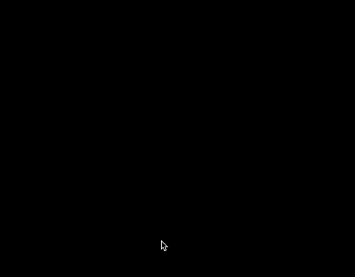
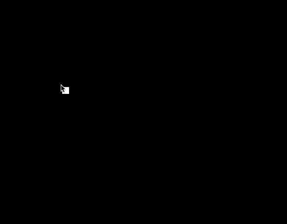
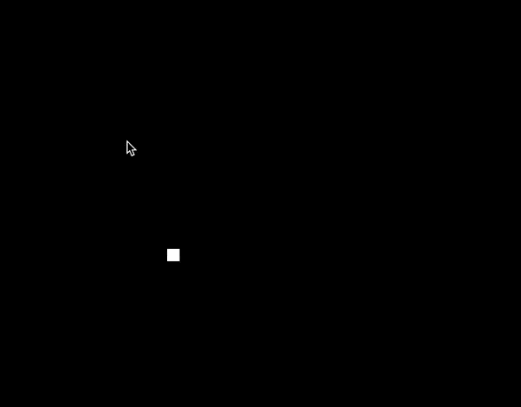
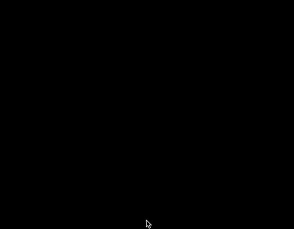

# Events in Processing

**To start this lesson, students should:**

- Be familiar with if statements, while loops, and functions
- Have some practice/famliarity with Processing's coordinate system and how to draw shapes in Processing

**By completing this lesson, students will learn:**

- How to check for keyboard events
- How to check for mouse events
- How to move shapes on the screen

## Introduction
In the last lesson, you learned how to draw colorful shapes on the screen using pygame. In this lesson, we're going to learn how to make your game interactive and animated. 

Using these skills, you'll be able to build things like this!

or this!

> Note: the above image was actually built using processing. You can see more cool art people have built with processing [here](https://www.openprocessing.org/browse/#).
 
## Animations

### Setup

Let's start with the setup of your program.
Go ahead and add these lines to your code:

    def setup():
    	size(600, 600)

The setup function holds all the code we want to run right when the program starts - ie: all the setup. You can read more about it [here](http://py.processing.org/reference/setup.html).
 
### Introducing the Draw Loop

Let's get to the interesting part: The [draw loop](http://py.processing.org/reference/draw.html). This allows us to add animation to our project. The way that the draw loop works is that all the code inside of it will keep repeating roughly 60 times per second.

Let's try an example. Try adding this to your code.

	def draw():
		print("StreetCode is awesome!")

When you run it, you should see something like this:

This is because the code: 

	print("StreetCode is awesome!")
	
is getting repeated over and over since it is in the draw loop.

### The Draw Loop with Variables

Let's try a different example. Try replacing the code you just wrote with this.

	x = 0
	
	def draw():
		global x
		print(x)
		x = x + 1
		
Before you run that, let me explain the line:

	global x
	
This probably doesn't make sense at the moment. What this line of code is doing is telling the code below it in the draw function to treat the variable, x, as a **global variable**. You can read about what global variables are [here](http://py.processing.org/reference/globals.html). Make sure to talk it over with a mentor if it doesn't make sense because we'll be using these a lot.

Before you run your code, see if you can figure out what it will print, then go ahead and run it.

Were you right? Talk with a mentor and see if you can make sense of what happened.

### Putting it together to animate shapes

Okay, now for the cool part. Try replacing the code you had with this:

	x_pos = 0
	def draw():
	    global x_pos
	    rect(x_pos, 20, 15, 15)
	    x_pos = x_pos + 5
	    
Your code should now look something like this: 

When you run it, you should see something like this:

Great! Now we have a square moving, but what's up with the trail of squares left behind by it? 

This is because the screen doesn't automatically refresh each time - anything you draw just gets added to what's already been drawn! To get rid of that, we'll need to add this line of code to our draw function:

	background(0,0,0)
	
This works because the `background` command will cover the whole screen in a background, eliminating the past drawings left from previous frames.

If you run it now, you should see something like this:

> Note: you can try messing with the numbers in the `background` function and see what happens. Read more [here](http://py.processing.org/reference/background.html) to find out more about how that function works.

Awesome! We have our moving square. If you remember the [fill](http://py.processing.org/reference/fill.html) function from last lesson, you can try messing with the color of the square as well.

Why does this all work? If you remember in the previous examples, since the `draw` loop repeats over and over and is adding to the variable, `x_pos` each time. This causes the square to get drawn further to the right each time since the variable, `x_pos` , controls the x position of the square.

Go ahead and talk this over with a mentor or partner if it doesn't make sense.

### Your turn!

We just walked together through the process of making a square move to the right. Now, see if you can make the square move downwards instead.

After that, you can try diagonal.

That's it! Feel free to move on to the Keyboard Events section, or try some of the challenges if you're up for it.

#### Challenges: 

- Try to move multiple shapes at once but at different speeds
- Make a finish line (draw a new long skinny rectangle), and have the box stop at the finish line

## Mouse Events 
In many games you play, you use the mouse! Many games involve using the mouse for shooting, picking up powerups and more. Here, we'll start learning how to make our programs interact with the mouse in Processing.

### Make the square follow your mouse
First, let's try to move a rectangle around with the mouse. Let's look back at how to make a [rectangle](http://py.processing.org/reference/rect.html) in Processing.

	rect(x,y,width,height)
	
> Of course, when we do it, we'd replace each of these with the numbers/variables we want those values to equal.

If we want the rectangle to follow the current position of the mouse, we'll have to track its X and Y coordinates. Luckily we Processing has two special variables tha can help us with this: [mouseX](http://py.processing.org/reference/mouseX.html) and [mouseY](http://py.processing.org/reference/mouseY.html).

Here's how they work: at any time, the variable, `mouseX` will equal the X coordinate of the mouse, while `mouseY` will equal the Y coordinate of the mouse.

This means we can use these to make a rectangle follow our mouse around the screen. Try pasting this code into your window and running it.

	def draw():
		background(0,0,0)
		rect(mouseX,mouseY,15,15)

and you should see something like this:

### Make things happen when you click

Now, let's find out how to make things happen when the user clicks the mouse. To do that, we'll need to learn how to use the [mouseIsPressed](http://py.processing.org/reference/mousePressed_var.html) variable. To illustrate that, we'll do an example where we'll change the background color whenever we click.

<!--
To find out when the left or right button are being pressed. You use: [mouseButton](http://py.processing.org/reference/mouseButton.html) along with mousePressed. 
-->

Let's modify our code to look like this:

	def draw():
		background(0,0,0)
		if mousePressed:
			background(255,0,0)
		rect(mouseX,mouseY,15,15) 
    
Now when you run your code, you should see something like this:

Let's breakdown the code. 

	if mousePressed:
        background(255,0,0)

Here, the `mousePressed` variable is only `true` when your mouse is held down. Since this is in an if statement, the background will only change if the mouse is pressed. 

### Your Turn

Now it's your turn. See if you can modify your existing code such that whenever you hold down the mouse button, you see a circle instead of a square.

> Note: The first time you try this, you might see both a circle and a square. To solve this problem, you might need to use an `else` statement with your `if` statement.
> 
> If you either haven't learned what an else statement is yet or forgot, you can read about how they work [here](https://www.w3resource.com/python/python-if-else-statements.php). Be sure to talk it over with a mentor if it doesn't make sense.

### Challenges

* Try to change the color of the shape as well when you click, but have the shape become white after you release the mouse.
* Make it so that the shape becomes a different color if you click the right versus left mouse button. Hint: learning how to use [mouseButton](http://py.processing.org/reference/mouseButton.html) will be useful for this.
* Make it so that the shape stays on the opposite side of the screen from your mouse and moves in the opposite directions.

As always, feel free to experiment and try something new. If you want to learn more about what you can do with the mouse, feel free to look at the Processing [reference manual](http://py.processing.org/reference/).

## Keyboard Events
Alright, now we've learned how to make objects on the move. We also learned how to mainpulate the rectangle using our own inputs. Now we are going to be using the keyboard to manipulate the rectangle. 

Lets start by making our box from the last section move to the right again, but
only when we are pressing a key on the keyboard. Remember, the inside of the
draw function is run once for every *frame* of the game. To be able to do
something when a key is pressed, we want to see if the key is being pressed
during that frame of the game.

#### Give it a Try!
Now you will be able to check when the keyboard key is [pressed](http://py.processing.org/reference/keyPressed.html) or [released](http://py.processing.org/reference/keyReleased.html), among other things. The keyPressed function returns 'True' if the key is pressed in the current frame. Let's make the rectangle move to the right. Inside the draw function add the following line of code: 

	if((keyPressed):
		...

The above statement will be true when you press any key on your keyboard, and then it will run the code inside the if-loop. The key could be the up key, down key, d key, any key will make the rectangle move.
You can use Alphabets, Numerical Values and other coded keys in processing. For all the ASCII(alphabets and numerical values) keys you will use [key](http://py.processing.org/reference/key.html) and [keyCode](http://py.processing.org/reference/keyCode.html) for the remaining. 

But we want the rectangle to move to the right only when we press the right key. How we are going to do this is using a nested if statement:

	if((keyPressed):
		if(keyCode == RIGHT):
			...
		
		
What is an nested if statement? The program will first run through the first if statement which is the if((keyPressed):, then if the condition is true, it will run through to the second if statement which is the if(keyCode == RIGHT): statement. Now why would we want to use a nested if statement?

A nested if statement is useful if we have multiple conditions we want to fulfill. The multiple conditions we want to fulfill is if a key is pressed, and if it is the right key. If both if statements are true, then the rectangle moves right shown below.

Congrats! Now let's make the rectangle move in all 4 directions as shown below. Use the code from above to make the rectangle move in all four directions! 

Now you should be able to do something like this: 

**Challenges**:

- Make your box change to a *random* color by pressing the SHIFT key. *(Hint: you can use
  `fill(..)`)* to change the color of a shape
  
- Look up how to get a random number in python

- Make your box move faster if the CONTROL key is being pressed

> You can look at more examples and tutorials in processing [here](http://py.processing.org/tutorials/interactivity/). Try to replicate them without looking at the code. 
