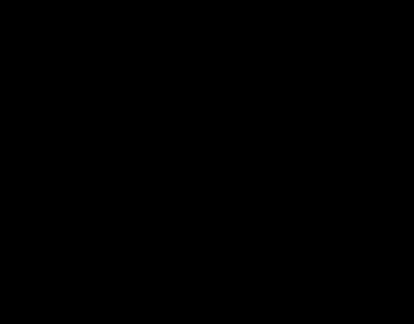
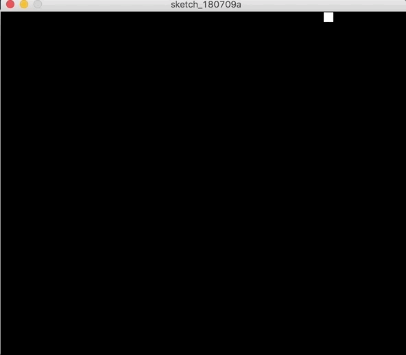
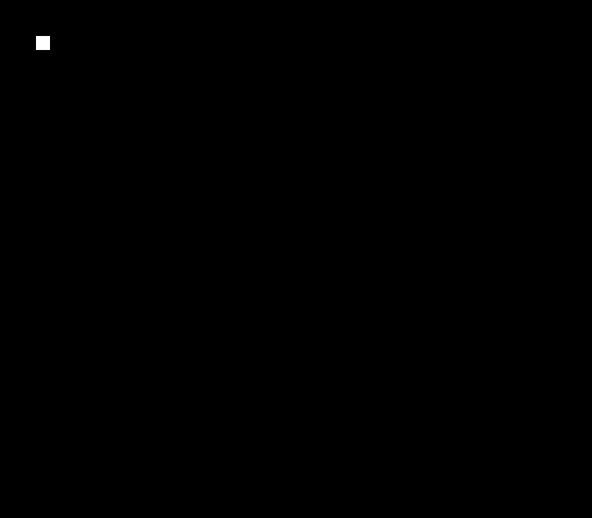
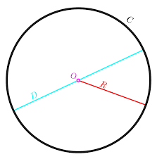
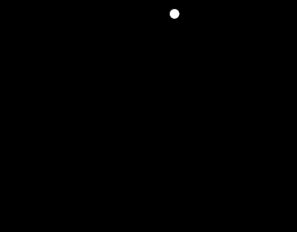
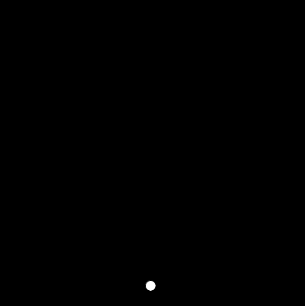
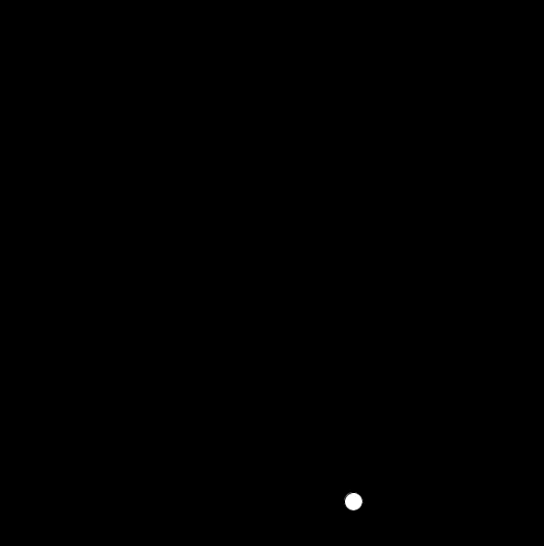

# Velocity and Collision in Processing

**To start this lesson, students should:**

- Be familiar with if statements, while loops, and functions
- Understand how Processing's `draw` loop works
- Have some practice/famliarity with Processing's coordinate system and how to draw and animate shapes in Processing

**By completing this lesson, students will learn:**

- How to conceptualize velocity in Processing and implement it using variables.
- How to implement shapes bouncing off walls in Processing.
- An overall better understanding of positioning and movement in Processing.
 
## Velocity

To start with, let's review some code from the last lesson:

	def setup():
		size(600, 600)
	
	x = 0
	def draw():
		background(0,0,0)
		global x
		rect(x, 20, 15, 15)
		x = x + 5
	    
Here, we have the code we wrote last lesson to make a square move across the screen. You can paste that code into your window and test it.

Now, let's look at an example that is very similar, but with a slight tweak:

	def setup():
	    size(600, 600)
	
	x = 0
	velocity = 5
	def draw():
	    background(0,0,0)
	    global x, velocity
	    rect(x, 20, 15, 15)
	    x = x + velocity
	    
Is this any different? Using the **velocity** variable instead of automatically adding 5 to `x` actually doesn't cause your code to run any differently at the moment. However, it will become clear why this is useful soon.

Try messing with the value of the `velocity` variable. If you make the value much higher than 5, you might see something like this:

On the other hand, if you make the `velocity` variable negative and `x` start as 500? You end up with something like this:

## Your turn!

You may remember doing this last time, but this time we're going to try it with using variables. See if you can modify your existing code to make the square move diagonally using variables for the velocity.

> Hint: It may be helpful to use two variables rather than one for velocity here.
 

Once you've done that, see if you can mess with each of the velocities to make the square move at different angles.

## Challenge 

Lets make two rectangles that each move in opposite directions. Start with the code below.

	def setup():
	    size(600, 600)
	
	x1 = 20
	y1 = 20
	x2 = 580
	y2 = 580
	
	def draw():
		global x1, y1, x2, y2
		background(0,0,0)
		fill(255,0,0)
		rect(x1, y1, 15, 15)
		fill(0,0,255)
		rect(x2,y2,15,15)

At the moment, the squares won't be moving. See if you can write code so that the two squares move in toward each other like this. Remember to use variables for the velocity values.

Once you get that, try modifying the velocities to have them each go in different angles - like this:

##Wall collisions

One important part of a lot of games is having objects behave differently when they hit a wall. 

Below is an example of what the code could look like to just a ball to the right.

	def setup():
	    size(600, 600)
	
	x = 50
	y = 50
	velocity = 5
	def draw():
	    background(0,0,0)
	    global x, y, velocity
	    ellipse(x,y,20,20)
	    x = x + velocity
	    
What if we wanted the ball to stop when it hits the wall?

	   
<!--

Remember that the x coordinates and y coodinates of an ellipse represent the middle of the ellipse in this case the O in the picture above. The width is the diameter, which is the D in the picture. To get the right edge we need to do O + R. Half of a diameter is the radius. So we need the radius. In the case of the photo above do xPos + width/2.
Then we need to check if the right edge hit the wall using an if statement like below
-->

Try modifying your code to look like this instead.

	def setup():
	    size(600, 600)
	
	x = 50
	y = 50
	velocity = 5
	def draw():
	    background(0,0,0)
	    global x, y, velocity
	    ellipse(x,y,20,20)
	    if x + 10 >= 600:
	    	velocity = 0
	    x = x + velocity
	    
You'll notice the only difference with this code is this if statement:

	if x + 10 >= 600:
	    	velocity = 0
	    	
Here, the computer checks if the edge of the circle is up to the edge of the wall (which is when its x coordinate is greater than or equal 600 since we set the width of the window as 600).

> `>=` in computer science means "greater than or equal to"

Remember that the x coordinate of the ellipse represents the middle of the circle. We have to add 10 to `x` the if statement to make sure that we're checking the edge of the circle rather than the middle of it. 

Feel free to talk this over with another student or mentor.

Now let's try modifying the code so that the ball reverses direction instead of stopping. Try changing the if statement to look like this:

	if x + 10 >= 600:
	    	velocity = -5
	    
Now when you run it, you should see the ball bounce off the right wall.

## Your Turn!

What if we want it to also be able to bounce off the other wall so that it looks something like this?

see if you can add to your existing code to make this happen.  

> Hint: if the right side of the wall has an `x` coordinate of 600, what would the left side be?  

Next let's modify our code so that the ball moves up and down in addition to left and right. You should be able to do this using the same code you did in the earlier exercise when we made the ball move diagonally.

Now, see if you can modify the code so that the ball bounces off the top and the bottom as well - like this:
  

 
 
## Challenge 

That's boring, we can see the pattern. Let's randomize it! Do you remember how to make things random? See if you can make the speed/direction change randomly when the ball hits the wall.

### More challenges

 - Make the ball change color everytime it bounces
 - Make the ball stop bouncing after 10 bounces
 - When you press a key, change the velocity

      

