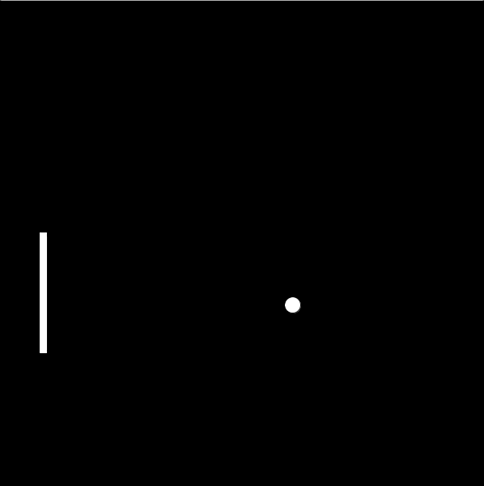

# Pong Project

**To start this lesson, students should:**

- Be familiar with key events lesson
- Understand object collision

**By completing this lesson, students will learn:**

- How to create a simple game
- How to use starter code

## Introduction

Today we are going to be creating a game called pong! I'm sure a lot of you have already seen this game. If not, below is an example

Wait but that isn't exactly pong! You are right. We are going to be making a simple pong game with only one player. 

## Goals

Before we start coding, let's look at some of the rules of pong.

 - If the ball hits the paddle, the ball bounces back
 - If the ball hits the right, top, or bottom wall, the ball bounces
 - If the ball hits the left wall, the game is reset, and the ball is returned to the original position
 - The player tries to hit the ball as many times as they can
 
## Starter Code

There should be a file called pongStarterCode. Open it and copy and paste the code into processing. You will notice several parts. Let's walk through them

### Before setup

You will notice this huge block of code

	xPos = 300
	yPos = 300
	speedX = random(10)
	speedY = random(10)
	paddleWidth = 10
	paddleHeight = 150
	xPaddle = 50
	yPaddle = 225
	paddleSpeed = 5
	ballHeight = 20
	ballWidth = 20

What these are, are variables. They are before setup because we are going to use them a lot. Please do not modify ANY of these variables. Once you have gotten pong to start working, then you can fiddle around with the values, but until then, leave them alone. 

### Setup

Let's look at the setup code
	
	def setup():
		size(600, 600)
	
Nothing too exciting, just sets up the screen. You won't be modifying this code so you can leave it alone.

### Draw

Now let's look at the draw code.

	def draw():
    		global xPos, yPos
    		global inGame
    		background(0, 0, 0)
    		ellipse(xPos, yPos, ballWidth, ballHeight)
    		rect(xPaddle, yPaddle, paddleWidth, paddleHeight)
    	
		if keyPressed and keyCode == SHIFT:
        		inGame = True
    
    		if inGame == True:
        		paddleMove()
        		ballMove()
  
What is this?? There is so many lines! Let's breakdown the lines. 

	global xPos, yPos
	global inGame

These two lines, introduce the global variables. Don't remember what global variables are? Look back at processing lesson 2.

	ellipse(xPos, yPos, ballWidth, ballHeight)
    	rect(xPaddle, yPaddle, paddleWidth, paddleHeight)
    
The first line creates the ball, and the second creates the paddle.

	if keyPressed and keyCode == SHIFT:
        	inGame = True
		
Pressing SHIFT starts the game. When SHIFT is pressed, the inGame variable switches to True. 

	if inGame == True:
        	paddleMove()
        	ballMove()
		
If inGame is True, then both the paddle and the ball will move. You'll be filling in the code for `paddleMove()` and `ballMove()`. The next section will be talking about what you are supposed to be coding in these parts.

What is this pass inside the functions? Don't worry too much about those. Those are there to help you be able to test your code.

### paddleMove()

For this part of code, we want to move the paddle up and down. This section will deal with keyEvents so try to remember those. Remember we only want the paddle to move up and down.

Tips for this section

 - Remember how velocity works
 - Remember how to use the keyboard for games
 - Look over lesson 2 if you are confused

### ballMove()

What we want from this section, is to have the ball move. This should look familiar, you should have done something similar in lesson 3. Look over lesson 3 if you need a refresher. This controls how the ball should move. 

Tips for this section

 - Remember how velocity works
 - Look over lesson 3 if you are confused

### wallCollision()

Now this gets interesting. Remember in lesson 3 how we had the ball bounce around if it hit the wall? Well now we are going to do it again. But remember, if the ball goes out of bounds on the left, it shouldn't bounce back.

Tips for this section

 - Remember the rules of pong
 - Understand collision
 - Look over lesson 3 if you are confused

### paddleCollision()

Now here is where the code might get difficult. We want the ball to bounce if it hits the paddle. I strongly suggest doing this after wallCollision, as understanding how wallCollision works will help with this one. 

Tips for this section

 - Understand how exactly collision works
 - Understand the coordinate system
 - Understand what the rect and ellipse code does exactly
 - Understand if statements

### resetGame()

This code should reset the game if the ball goes out of bounds. Look at the code before setUp and try to place the ball and paddle at its original starting location

### Putting it all together

You may notice that paddleCollision and wallCollision are not actually placed in the code. It is up to you guys to place the code. Think what paddleCollision and wallCollision do, and how it affects certain objects and how they should move. With resetGame, think where it should go in the code as well.
 
### Tips and tricks

There are several concepts that you need to understand if you are going to finish this game.

Key concepts

 - Key events (Lesson 2)
 - Collisions (Lesson 3)
 - Velocity (Lesson 3)
 
 
The biggest idea is understanding how to put together all the elements of what you have learned. Also understand how to incorporate functions into other sections of your code. Test individual parts of your code and make sure a function works before you start work on another. For instance make sure the ball moves correctly before you incorporate collisions. 

**Challenges**

If you finished the game, here are some challenges you can do.

- Score system, everytime the ball hits the paddle, increase your score
- Lives, everytime the game resets, take away a life until it is game over
- Two players
