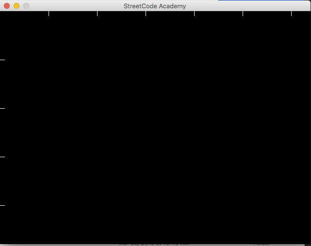

# Getting Started with Pygame

**To start this lesson, students should::**

* Be familiar with coordinate systems.
* Have familiarity and experience using variables.
* Have familiarity and experience using functions.

**By completing this lesson, students will:**

* Become familiar with Pygame.
* Learn how to draw shapes in Pygame.
* Become familiar with the computer coordinate system.

## What is Pygame?

If you want to make games, Pygame is the tool for you! In this lesson, we'll be showing you how to set up in pygame and teach you how to use Pygame to create some graphics. Eventually, you'll be able to use Pygame to build games like this!


> Check out other things people have made with Pygame [here](https://www.pygame.org/tags/all)!

## Setting up Pygame

### Make sure Pgyame is Installed

Ask a mentor to make sure that Pygame is set up on your computer. This should have been done already, but if not, a mentor should be able to help you.

> Mentors: you should be able to do this using: "python -m pip install pygame --user". There may be some extra steps here depending on if other things are already set up.

### Make sure the StreetCode Pygame folder has been downloaded. 

This also may have done already - look for the folder, "PyGameStreetCode", on your computer. If you can't find it, download it from [here](https://github.com/diwgan32/PyGameStreetcode) using this button:


If the folder is already on your computer, ask a mentor to help you make sure it's up to date (using `git pull`).

### Test things out!

Navigate to the "PyGameStreetCode" folder and open the "lesson_1.py" file using Idle. You should see something like this.

	 

If you go aheand and run the file, you should see this.



If you get any errors here, ask a mentor for help. Otherwise, you're ready to get started!

## Drawing Shapes in Pygame

### Drawing your first shape

Go ahead and add this line of code:

```python
display.draw_rectangle(200,100,200,100,ORANGE)
```

Below the `display = Screen(BLACK)` line of code and above the while loop. For now, you don't need to worry about what those parts of the code do.

Your code should now look something like this 


If you run the code again, you should see this:


Let's go ahead and dive into how the code works for this.

Go ahead and navigate [here](https://nathanielshak.github.io/pygamedocs/Screen.m.html) in another tab to see everything you can do with Pygame.

If you scroll down, you should see:


What does that mean?

For now, ignore the "self". Let's focus on the other numbers. If you look carefully, you'll notice that each of these match up with what we put in the parentheses in this line of code:

```python
display.draw_rectangle(100,200,200,100,ORANGE)
```

Which means that:

* x = 100
* y = 200
* width = 200
* height = 100
* color = ORANGE

All of these numbers are what we call in computer science, **parameters**. We'll go more in depth on those laters, but for now you have a fancy word you can use to impress people at the dinner table.

Go ahead and talk to a mentor and see if all these numbers make sense corresponding to the shape you see on your screen. Note that the x and y start from the **upper left** corner of the rectangle.

### Computer Coordinate Systems

As you're looking through all these numbers, if you've learned geometry before, all of them might make sense except for the y coordinate. 

That's because in computer coordinates, y increases from top to bottom, meaning that the top of the screen is where y = 0, then the bottom of the screen would be the largest y value.


Feel free to talk this through a mentor more until it makes sense.

### Try it! 

To get more familiar with the coordinate system, go ahead and make some more shapes using `display.draw_rectange`.

Once you have the handle on that, try the `draw_circle` function. If you look in [the documentation](https://nathanielshak.github.io/pygamedocs/Screen.m.html#core.Screen.Screen.draw_circle), you'll see:


Go ahead and draw a couple of circles as well. To see the different colors you can use, check [here](https://nathanielshak.github.io/pygamedocs/constants.m.html).

If you want to go crazy, you could even make something like this!


## Combining Drawing with Loops

Okay, if you tried to make the example above using only what we learned so far, it might take you hundreds of lines of code.

What if I told you that I was able to make that drawing using only around 4 lines of code?

Do you remember using for loops in Reeborg?


Go ahead and adding this to your code.

```python
for i in range(10):
	print(i)
```

When you run it you should see something like this in the console:


That's because when we run the for loop, the `i` in the for loop will actually be a variable that counts up as it repeats the loop.

Go ahead and talk through this with a mentor if it doesn't make sense. Go ahead and try out the following examples in your own code - see if you can predict what will print out before it prints!

```python
for i in range(3, 20):
	print(i)
```

```python
for i in range(9):
	print(i * 5)
```

Allright, now let's try something different. What happens if you do this?

```python
for x in range(33):
    display.draw_circle(x * 20, 100, 10, BLUE)
```

If you pop that into your code and run it, you should see something like this:


Go ahead and talk with a mentor and see if you can figure out how this is working.

### Your turn!

Okay, here's a challenge. See if you can create something that looks like this:


### Bonus Challenge

Once you finish that, if you want a challenge, see if you can create something like this:


> Hint: How could you repeat the code you created in the earlier part, and have it run multiple times with different x values?
 
### Bonus Bonus Challenge

If you want to have some fun, see if you could figure out how to do this?


> Hint: instead of inputing a color name, you can also make your own color using T(R,G,B) where you substitute R, G, and B with different Red, Green, and Blue values. 
> 
> If you do some quick Googling, you can figure out how to combine that with random numbers.
 
Anyways, that's it for this lesson! 

> Note to mentors: if your student is interested and you think it would be helpful, feel free to show them a bit about how to combine drawing with functions.