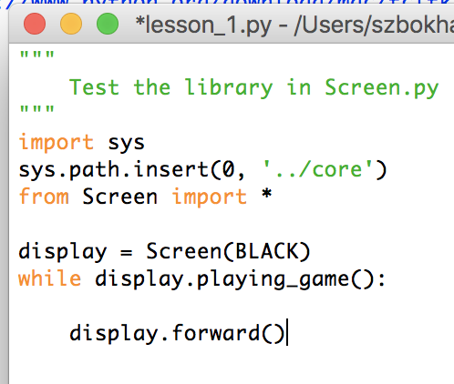
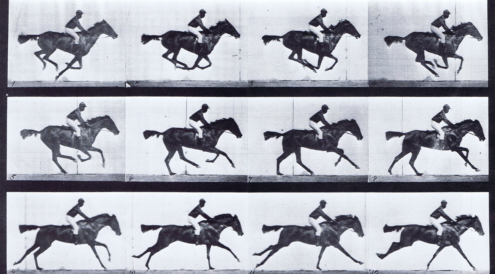
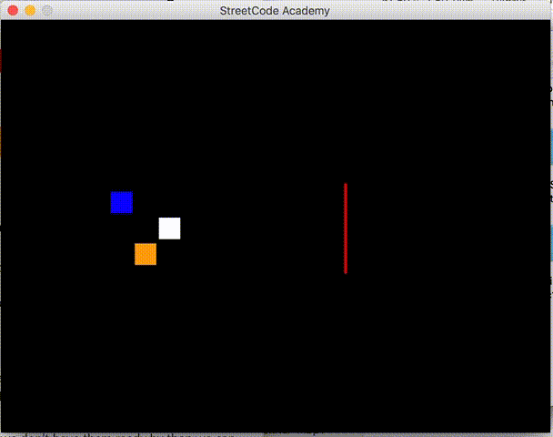
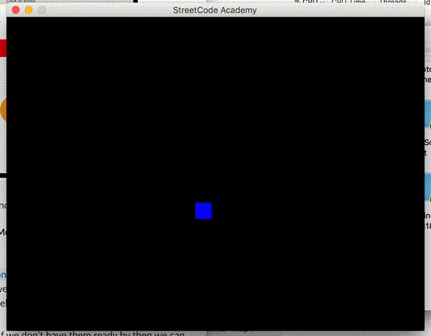
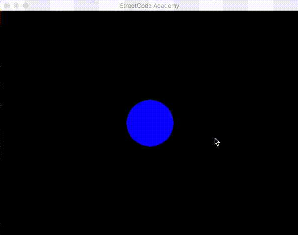

# Events in PyGame

**To start this lesson, students should:**
- Be familiar with functions, if statements, and while loops
- Know how to draw shapes in PyGame

**By completing this lesson, students will learn:**
- How to check for keyboard events
- How to check for mouse events
- How to move shapes on the screen


## Introduction
In the last lesson, you learned how to draw colorful shapes on the screen using
pygame. Thats pretty cool. In this lesson, we're going to learn how to make your
game interactive. This means that you will be able to make your game do
different things when the player presses a key on the keyboard, or clicks with
the mouse. With this you can me all sorts of games, like an airplane shooter, or
a the pong demo we saw last class. OK! Lets get started

## The Game Loop
Do you remember the code you started with from lesson 1? Let us take a closer
look at it.


In the last lesson, you added all of your drawing functions (like
`display.draw_rectangle(..)`), after the `display = ..` line, and before the
while loop. This allowed you to draw really cool pictures. But now, lets look
at the while loop. `display.playing_game()` will always be `True` while the
pygame window is open, so it is kind of like a `while True:` loop. Inside the
loop, we have the line `display.forward()`. What this does is it tells pygame
to move the game forward one *frame*. But what does this mean?


A game on the computer is kind of like a movie you watch in the cinema. A movie
strip is made up of multiple motionless frames, and a computer game is also done
the same way. (Ask your mentor to explain this in more detail). The inside of
the while loop in `lesson_1.py` runs once for every *frame* of the game, then
`display.forward()` tells pygame to go onto the next frame. If we want to make
a box move across the screen, we need to move it a little bit every frame of
the game. That way, when all of the frames are played one after the other, the
box will look like it is sliding across the screen. The more you move the box
each frame, the faster is will look like its moving.

### Give it a Try!
Lets start with trying to make a box move across the screen on its own. To do
this, we'll need 3 functions to add to `lesson_1.py`:
- `box = display.draw_rectangle(x, y, width, height, color)` to draw a box on
  the screen
- `(x,y) = box.get_position()` to get the current position of the box
- `box.set_position((x,y))` to move the box to the specified position

Work with your mentor to draw a box on the screen and move it to the right.
Your goal is to have your little box moving smoothly across the screen, like a
butterfly. Once you have done that, try making the box move up, down, and left.
See the gif below for an example:

**Challenges**:
- How would you make the box move diagonaly?
- Make a finish line (draw a new long skinny rectangle), and have the box stop
  at the finish line
- Use a loop to draw several boxes that all start side by side, and move at
  different speeds until they reach the finish line
- Looking at the docs for the keyboard events, we notice that there are also
  `right_is_pressed()` and `right_is_released()` functions. How are these
  different from the one we are using?



## Keyboard Events
Alright, now we've learned how to make objects on the move. However right now
our game just does whatever it wants to, without letting the player interact
with it. Thats pretty much just a movie, not a game!

Lets start by making our box from the last section move to the right again, but
only when we are pressing a key on the keyboard. Remember, the inside of the
while loop is run once for every *frame* of the game. To be able to do
something when a key is pressed, we want to see if the key is being pressed
during that frame of the game.

### Give it a Try!
In order to use keyboard events in your game, you must first set up the
keyboard. Add this line after the `display = ..` line:
```
keyboard = display.get_keyboard()
```
Now you will be able to check if keyboard keys are being pressed or released.
One of the functions to do this is `keyboard.right_is_down()`. This function
returns `True` if the right arrow key is being pressed in the current frame.
Work with your mentor to use this function in an if statement to make your box
move only when the right key is being pressed.

Once you have done that, use the other arrow key functions to make your box
movable in all directions. You can take a look at
[the keyboard docs](https://nathanielshak.github.io/pygamedocs/Keyboard.m.html)
to see what other keyboard functions you can use. Once its done, you should be
able to do something like this:



**Challenge**:
- Make your box change color by pressing the SPACE key. *(Hint: you can do
  `box.set_color(..)`)* to change the color of a shape
- Make your box move faster if the SHIFT key is being pressed

## Mouse events
In some games you play, you don't only use the keyboard, but also the mouse!
You might let the player move their character around the screen using the
keyboard and shoot using the mouse, or maybe let them pick up special powerups.
Using the mouse in Pygame is very similar to the keyboard. There are functions
you can use in an if statement to check when the left or right button are being
pressed. There are also two more functions that you might find useful, one to
get the current position of the mouse, and one to check if the mouse is
hovering on top of another shape.

### Give it a Try!
To play around with the mouse events, lets make a simple circle that changes
color when we hover over it, and jumps to a new position when we click on it.
Once again start from the `lesson_1.py` template and draw a circle somewhere on
the screen.

Now, to use mouse events, we must first set up the mouse. This is similar to
what we did for the keyboard. Add this line to your program after the `display
= ..` line:
```
mouse = display.get_mouse()
```

You can see the possuble mouse functions in [the mouse
docs](https://nathanielshak.github.io/pygamedocs/Mouse.m.html). The ones we'll
need are:
- `mouse.ontop(shape)`. This will return true if the mouse is on top of the
  shape you give to it.
- `mouse.left_is_pressed()`. This will return True if the left mouse button is
  pressed.

Now using these functions, first make it so that when the user moves the mouse
over the ball, it changes color, and when they move the mouse off, it goes back
to the original color (Hint: you can use two if statements or an if-else
statement).

Next make it so that when you click on the ball, it jumps to a new position
(remember `set_position(..)`). (Hint: you can use `and` in the if statement to
check if two things are true at the same time). If you want, you can have it
jump to a specific position, or to a random position.

If you do everything right (and you did the random position jumping), you should
get something like this:



**Challenge**:
- When the player right clicks on the ball, change the default color to
  something else.
- Make another shape (say a box) move to wherever the mouse cursor currently is
- Keep track of the number of times the player clicks on the ball, and draw the
  number of times on the screen using the `display.draw_text(..)` function.
