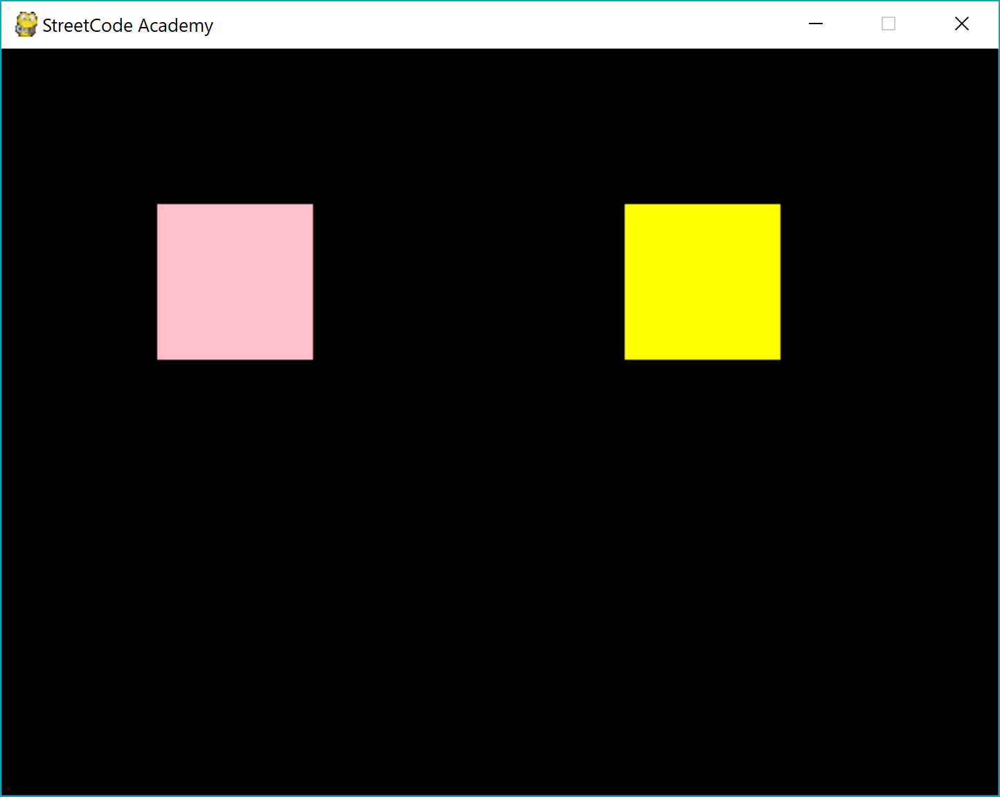

# Lesson 3: Collisions and Velocity in PyGame

**To start this lesson, students should**:

* Know how to check for keyboard events
* Know how to check for mouse events
* Know how to move shapes on the screen

**After this lesson, students will:**

* Be able to keep track of object velocity
* Manage object collisions
* "Bounce" objects post-collision


## Velocity: Gotta go fast!

Last time, we talked about moving objects on the screen using different key presses; for example, we programmed our game so that when we pressed the down, up, left, or right keys, the orange square would move in that direction by three pixels!

This time, we're going to learn how to make objects move for a longer amount of time and __continuously__: that is, the objects move across the screen without us needing to hold down the keys all the time. This is useful for a lot of different games, as we'll see soon.

To be able to do this, we'll need to introduce another concept: **velocity**. Velocity is simply how fast an object is moving. The bigger the number, the faster we're moving! There are two parts to velocity: the **sign** and the **number**. A *negative* number means we are moving in the negative direction, and a *positive* number means we are moving in the positive direction. A large positive number means we're moving quickly in the positive direction, and a large negative number means we're moving quickly in the opposite direction.

Velocity can be in two directions: the x direction or the y direction.

Let's revisit this image of the coordinate system for computers:


If the black dot moved from where it is now all the way **down** to 6 (0, 6) in 1 second, that would be a velocity of 6 squares per second in the y direction! If the black dot moved all the way to the **right** to 3 (3, 0) in one second, we would say the dot has a velocity of 3 squares per second in the x direction.

#### Some review questions for you!

If the dot moved from 6 to left to 4 in one second, what is its velocity? In what direction?

If the dot moved from (2, 2) to (3, 4) in one second, what is its velocity in the x direction? How about in the y direction?


### Velocity in PyGame

Now, we're ready to look at velocity in PyGame. We know that velocity has two possible directions: x or y. We can write these values for the computer in the form of **variables**.

```python
x_vel = 10
y_vel = -3
```

Here, we're saying that the velocity we want to keep track of is +10 in the x direction and -3 in the y direction. What does this mean? Well, for every unit of time (say, a second), we will have our object move 10 squares to the right and 3 squares back up.

We can also keep track of the actual position (x, y coordinates) using variables, too!

```python
x_pos = 100
y_pos = 100
```

What does this mean? Well, we told the computer that our object will be put at the (100, 100) position, and we want it to move at our ```x_vel``` and ```y_vel``` velocities.

Now, open up ```lesson_3.py```. You should see a screen with some code that looks a lot like what we've done up here!

Specifically, you'll find:

```python
pos_x = 100
pos_y = 100
vel_x = 1
vel_y = 1
```

In the next portion of the code, you'll see:

```python
while display.playing_game():
    my_shape.move([vel_x, 0])
    display.forward()
```

First, make a guess about what this program is going to do. Then, click "Run", then "Run Module" to see what happens!

You should see a pink square moving across the screen, like so:


### Using set_velocity()

Now that you understand how to use variables to change the velocities of our objects, we can take a cool shortcut that PyGame has to offer us!

There is a function in the *library* of PyGame that is super useful; it's called **set_velocity()**. This function does exactly what you think it does! It changes the velocity for your object. Looking back at the beginning of our program, we have:

```python
"""
    Test the library in Screen.py
    """
import sys
sys.path.insert(0, '../core')
from Screen import *

display = Screen(BLACK)
keyboard = display.get_keyboard()
my_shape = display.draw_rectangle(100, 100, 100, 100, PINK)
```

See that last line there? When you create ```my_shape```, you're creating a new variable that represents the rectangle on the screen. One awesome thing we can do is operate on this object using a **function**. The function can do things to the object and change its state. Specifically, the way we're going to change the velocity of ```my_shape``` is going to be:

```python
my_shape.set_velocity([vel_x, vel_y])
```

Let's break this down into pieces.

* ```my_shape``` is your **object**.
* ```set_velocity()``` is the name of the function we're using to **change the velocity**. What goes inside it? Well...
* ```[]``` signals that you're going to hand in a list of things. The two things in this list will be:
* ```vel_x```, or your new velocity for your **x** direction, and
* ```vel_y```, or your new velocity for your **y** direction.

So, what are we doing in total? We're saying that we're going to **change the velocity** for our **object** by giving it new **x** and **y** velocities.


#### Try it out!

Time to create two moving squares...you can do it!



Your task is to create an object of your choice that moves from the top right corner of the screen to the bottom left corner of the screen at a speed that you like, and to create a second object that moves from the top left corner of the screen to the bottom right. Use the code that we've given you in the activity to begin, and check in with your mentor when you think you have your solution!


## Onto Collisions: BOOM!

Now that we've created our two rectangles, we want to be able to let them interact with each other! For example, if the two rectangles touch each other, we want to be able to tell them to bounce off of one another, or if a rectangle leaves the boundary, we want it to bounce back off the wall.

How do we do this? Well, there's a handy function called ```collided_with()``` that we can use to detect whether our objects have touched each other. Here's how you use it:

```python
display.collided_with(my_shape, my_other_shape)
```

This function, just like what you saw in Reeborg with ```front_is_clear()```, returns a ```true``` or ```false``` value, meaning that it only answers "yes" or "no". So, when ```display.collided_with()``` returns ```true```, it means that the two shapes collided, and if ```display.collided_with()``` returns ```false```, it means that the two objects haven't collided.

Since this function returns a true/false value, we can use it as a **condition**! Remember how those worked in ```if``` statements and ```while``` loops?

```python
if some_condition():
    do_this()
```

or

```python
while some_other_condition():
    do_something_until_condition_is_false()
```

One very important thing to go over is that the function ```collided_with()``` can only be called on the ```display``` screen of PyGame. What does this mean? Well, this means that ```display.collided_with(my_shape, my_other_shape)``` is a perfectly valid statement, but ```my_shape.collided_with(my_shape, my_other_shape)``` would NOT work. This is because the function ```collided_with``` is something that the screen can determine, not the shape itself. So, we can only use ```collided_with()``` with the display screen.

MAKE SURE that the above concept is clear! Go over this concept with your mentor through the following brief activity.

#### Function Puzzle Quick Review

Which of the following statements are correct? Why are the incorrect ones incorrect? Discuss this with your mentor.

* ```my_shape.move([0, 2])```
* ```display.move([2, 4])```
* ```my_shape.collided_with(my_shape, my_shape2)```
* ```display.set_velocity([4, 4])```
* ```display.collided_with(my_shape, my_shape2)```
* ```my_shape.set_velocity([-1, 3])```

This concept is extremely important in programming; we always need to know which types of variables can use which functions, just like in real life, where we can't just say ```person.meow()``` if a person can't meow, but ```cat.meow()``` makes much more sense!


### Your Turn

Now that we've covered velocity and collisions, we can start making objects in our game interact! How neat is that? Your task here is to use the display you created with two squares and modify it to create this situation:

Start with one square at the upper left corner, and one square at the lower left corner, like so:


Next, write a program that has the yellow square move to the pink square automatically, but then when they collide, the yellow square stops.

> Hint: You need to use the ```collided_with()```, ```set_velocity()```, ```if``` statement, and ```while``` loop to make this happen!

Now that you have the yellow square stops moving, modify your program so that when the yellow square hits the pink square, the yellow square actually bounces off the pink square and heads in the **opposite** direction at the same speed.

> Hint: Remember how velocity works? You control it using ```set_velocity()``` or through a variable. What determines what direction the velocity is in? How do you make something go in the opposite direction? Break it down into the ```x``` and ```y``` velocities.
>
> Now change the velocities. How do you go about changing those numbers?

Your final challenge is to make it so that when the yellow square bounces off the pink square, it travels backward in a slower velocity, but still in the opposite direction. How would you modify what you did earlier to make this change?


## Hit a Wall?

Did you notice that you couldn't stop your rectangles from sliding off the screen? One last thing we want to take care of is making objects stay in the screen, which might come in handy for making games.

To do this, we will use the ```x()``` and ```y()``` functions for objects. These functions give us the x and y positions for the **upper left corner** of the object you operate on. To calculate when the rectangle has slid off the screen, we want to check if the *upper left corner* x or y is less than 0, and we want to check if the *lower right corner* is larger than the dimensions of the screen. Check in with your mentor to make sure this makes sense.

In the diagram below, notice that whenever we touch the red lines, which are contained in the four ```(x, y)``` coordinates written in red, we want to flip our velocity and turn around in the opposite direction.


To see this movement in action, we will write:

```python
if my_shape.x() < 0 or my_shape.x() + 100 > 640:
        vel_x = vel_x * -1
if my_shape.y() < 0 or my_shape.y() + 100 > 480:
        vel_y = vel_y * -1
```

This might look complicated, but here's what we're doing:

* ```if``` our rectangle's ```x``` value is less than 0, we want it to go in the **opposite** ```x``` direction.
* ```if``` our rectangle's ```y``` value is less than 0, we want it to go in the **opposite** ```y``` direction.
* ```if``` our rectangle's LOWER RIGHT corner, which is the ```x``` value + the width, or ``100``, is greater than the ```x``` size of the screen (640), we want it to go in the **opposite** `x` direction.
* ```if`` our rectangle's LOWER RIGHT corner, which is the `y` value + the height, or `100`, is greater than the `y` size of the screen (480), we want it to go in the **opposite** `y` direction.
* We make two different ```if``` statements to check for these conditions: one for the ```x``` value of our rectangle and one for the ``y`` value.

Once we add these lines of code to our program, we keep the rectangle inside the bounds of our window by making them bounce off of the walls!


## Making a Bouncing Ball

Now that we've learned all about velocity and bouncing our objects off of each other using collisions, we have to put this into practice! Let's make a bouncing ball.

Your task: Use the `my_circle = display.draw_circle()` command to draw a circle on the screen, putting the circle at the top right corner. Next, every time the circle hits the bottom of the screen, you want it to bounce back up to only half of its original height. Meanwhile, the entire time, you want the `x` position for the ball you draw to be increasing at a speed of `1`.

> Hint: How do you keep track of a changing value (the height of your circle)? How do you check to see if the circle has hit the bottom of the display? How do you make the circle bounce back up? How do you change velocity?
>
> Finally, how do you get the circle to always be moving to the right, but moving up and down in different ways? Think about the `x` and `y` position and velocity of the circle.